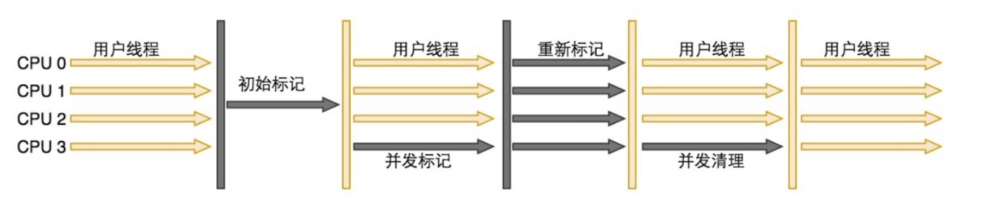
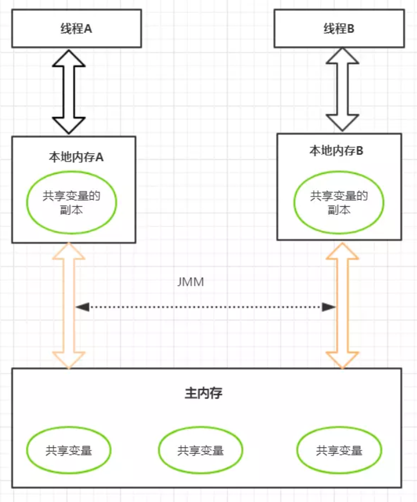

# 一、JVM

## 1、JVM基础概念

>   JDK、JRE、JVM的关系

JDK (Java开发工具包，包含JRE和一些小工具，如打包工具 jar.exe，编译工具javac.exe) > JRE (Java运行时环境，还包含一些Java的基本类库，想运行Java程序，安装JRE就够了；大部分都是 C 和 C++ 语言编写的) > JVM

>   常见JVM参数

jar包直接 java JVM参数 -jar jar包名

-   堆栈配置相关

-Xmx3550m：最大堆大小为3550m

-Xms3550m：设置初始堆大小为3550m

-Xmn2g：设置年轻代大小为2g

-XSS128k：每个线程的堆栈大小为128k

-XX:MaxPermSize：设置持久代大小为16m

-XX:NewRatio=4：设置年轻代与年老代的比值

-XX:SurvivorRatio=4：设置年轻代中Eden区与Survivor区的大小比值

-XX:MaxTenuringThreshold=0：设置垃圾最大年龄。如果设置为0，则年轻代对象不经过 Survivor区，直接进入年老代

-   垃圾收集器相关

-XX:+UseParallelGC：选择垃圾收集器为并行收集器

-XX:ParallelGCThreads=20： 配置并行收集器的线程数

-XX:+UseConcMarkSweepGC：设置年老代为并发收集

-XX:CMSFuIIGCsBeforeCompaction：由于并发收集器不对内存空间进行压缩、整理，所以运行一段时间以后会产生“碎片”，使得运行效率降低。此值设置运行多少次GC以后对内存空间进行压缩、整理

-XX:+UseCMSCompactAtFullCollection：打开对年老代的压缩。可能会影响性能，但是可以消除碎片

-   辅助信息相关

-XX:+PrintGC

-XX:+PrintGCDetails

>   JVM调优工具

jconsole jvisualvm

>   内存泄漏和内存溢出

内存溢出：申请内存但没足够空间

内存泄漏：申请内存，但无法释放已申请的空间

>   Java会有内存泄漏吗

会，长生命周期的对象持有短生命周期对象的引用，尽管短生命周期对象已经不再需要，但是因为长生命周期对象持有它的引用而导致不能被回收

>   OOM的几种情况

数据运行区、栈、堆、永久代

>   JVM常用工具

jps ：显示本地的Java进程

jinfo 进程pid ：运行环境参数

jstat：监视虚拟机各种运行状态信息

jstack：观察 JVM 中当前所有线程的运行情况和线程当前状态

Jmap：观察运行中的JVM物理内存的占用情况

## 2、JVM位置

## 3、JVM内存区域划分

方法区：存储虚拟机加载的类信息、常量、静态变量、即时编译器编译后的代码数据等，即永久带，回收目标主要是常量池的回收和类型的卸载，各线程共享

执行引擎：包含即时编译器和垃圾回收器，将字节码翻译成底层系统指令

## 4、JVM中对象创建过程

1.   检查该指令的参数能否在常量池中定位到一个类的符号引用，并检查引用代表的类是否已被加载、 解析和初始化，如果没有就先执行类加载
2.   通过检查通过后虚拟机将为新生对象分配内存
3.   完成内存分配后虚拟机将成员变量设为零值
4.   设置对象头，包括哈希码、GC信息、锁信息、对象所属类的类元信息等
5.   执行init方法，初始化成员变量，执行实例化代码块，调用类的构造方法，并把堆内对象的首地址赋值给引用变量

>   内存分配策略

1.   指针碰撞：这种方式在内存中放一个指针作为分界指示器将使用过的内存放在一边，空闲的放在另一边，通过指针挪动完成分配
2.   空闲列表：对于 Java 堆内存不规整的情况，虚拟机必须维护一个列表记录哪些内存可用，在分配时从列表中找到一块足够大的空间划分给对象并更新列表记录

>   对象内存分配如何保证线程安全

1.   对分配内存空间采用CAS机制，配合失败重试的方式保证更新操作的原子性。该方式效率低
2.   每个线程在Java堆中预先分配一小块内存，然后再给对象分配内存的时候，直接在自己这块"私有"内存中分配。一般采用这种策略

>   对象的内存布局

对象在堆内存的存储布局可分为对象头、实例数据和对齐填充

对象头主要包含两部分数据：MarkWord、类型指针。MarkWord 用于存储哈希码(HashCode)、GC 分代年龄、锁状态标志位、线程持有的锁、偏向线程ID等信息

类型指针即对象指向他的类元数据指针，如果对象是一个数组，会有一块用于记录数组长度的数据

实例数据存储代码中所定义的各种类型的字段信息

对齐填充起占位作用。HotSpot 虚拟机要求对象的起始地址必须是8的整数倍，因此需要对齐填充

>   对象访问

Object obj = new Object()； 

假设这段代码出现在方法体中，那么“Object obj”部分的语义将会反映到Java 栈的本地变量表中，作为一个 reference 类型的数据存在。而“new Object()：”部分的语义将会反应到 Java 堆中，形成一块存储 Object 类型所有实例数据值(Instance Data)的结构化内存， 根据具体类型以及虚拟机实现的对象分布的不同，这块内存的长度是不固定的。另外，在 JAVA 堆中还必须包含能查找到此对象内存数据的地址信息，这些类型数据则存储在方法区中。 由于 reference 类型在 Java 虚拟机中之规定了指向对象的引用，并没有规定这个引用要通过哪种方式去定位，以及访问到Java 堆中的对象的具体位置，因此虚拟机实现的对象访问方式会有所不同。主流的访问方式有两种：句柄访问方式和直接指针

1.   如果使用句柄访问方式，Java 堆中将会划分出一块内存来作为句柄池，reference 中存储的就是对象的地址，而句柄中包含了对象实例数据和类型数据各自的具体地址信息
2.   如果通过直接指针方式访问，Java堆对象的布局中就必须考虑如何放置访问类型数据的相关信息，reference 中直接存储的就是对象的地址

两种方式各有优势，局并访问方式最大的好处是 reference 中存放的是稳定的句柄地址， 在对象被移动时，只会改变句柄中的实例数据指针，而reference 本身不需要被修改。而 指针访问的最大优势是速度快，它节省了一次指针定位的开销，由于对象访问在 Java 中非常频繁，一次这类开销积少成多后也是一项非常可观的成本。 具体的访问方式都是有虚拟机指定的，虚拟机 Sun HotSpot 使用的是直接指针方式，不过从整个软件开发的范围来看，各种语言和框架使用句柄访问方式的情况十分常见

>   TLAB

TLAB 的全称是 Thread Local Allocation Buffer，即线程本地分配缓存区，这是一个线程专用的内存分配区域。 由于对象一般会分配在堆上，而堆是全局共享的。因此在同一时间，可能会有多个线程在堆上申请空间。因此，每次对象分配都必须要进行同步（虚拟机采用 CAS 配上失败重试 的方式保证更新操作的原子性），而在竞争激烈的场合分配的效率又会进一步下降。JVM 使用 TLAB来避免多线程冲突，在给对象分配内存时，每个线程使用自己的TLAB，这样 可以避免线程同步，提高了对象分配的效率。

# 二、类加载器

J类的加载是动态的，保证程序运行的基础类完全加载到jvm中，其他类在需要的时候才加载

>   类加载方式

1.   隐式装载，new对象时
2.   显式装载，class.forName()、反射等方法

>   引起类加载的行为

1.   遇到 new、getstatic、putstatic 或 invokestatic这四条字节码指令
2.   反射调用的时候，如果类没有进行过初始化，则需要先触发其初始化
3.   子类初始化的时候，如果其父类还没初始化，则需先触发其父类的初始化
4.   虚拟机执行主类的时候(main)
5.   JDK1.7动态语言支持

## 1、类加载过程

Class 文件由类装载器装载后，在JVM 中将形成一份描述Class 结构的元信息对象，通过该元信息对象可以获知Class 的结构信息：如构造函数、属性和方法等

虚拟机把描述类的数据从 class 文件加载到内存，并对数据进行校验，转换解析和初始化，最终形成可以被虚拟机直接使用的Java 类型，这就是虚拟机的类加载机制

加载： 

1.   通过全类名获取类的二进制字节流
2.   将类的静态存储结构转化为方法区的运行时数据结构
3.   在内存中生成类的Class对象，作为方法区该类的数据访问入口 

链接(把二进制数据合并到JRE中)：

-   验证：

    文件格式(验证字节流是否符合 Class 文件的规范，如主次版本号是否在当前虚拟机范围内，常量池中的常量是否有不被支持的类型)

    元数据(对字节码描述的信息进行语义分析，如这个类是否有父类，是否集成了不被继承的类)

    字节码(是整个验证过程中最复杂的一个阶段，通过验证数据流和控制流的分析，确定程序语义是否正确，主要针对方法体的验证。如方法中的类型转换是否正确，跳转指今是否正确等)

    符号引用(在后面的解析过程中发生，主要是为了确保解析动作能正确执行)

-   准备：在方法区内为静态变量分配内存并设置为默认值

-   解析：虚拟机常量池的符号引用(标识)转化为直接引用(指向地址)，在初始化动作完成之前或之后

初始化：执行类构造器clinit方法，如果父类没初始化，先初始化父类。多线程环境下clinit会正确加锁和同步。对静态变量和静态代码块进行初始化

使用

卸载

## 2、类加载器的分类

1.  引导类加载器（BootstrapClassloader）：用C++编写(针对hotspot)，是JVM自带的类加载器；负责加载Java的核心类库( <JAVA_HOME>\lib 或者 -Xbootclasspath指定的路径 )(该加载器无法直接获取)
2.  扩展类加载器（ExtClassloader）：Java编写，负责加载<JAVA_HOME>\lib\ext  或者 java.ext.dirs系统变量指定的路径的jar包
3.  应用程序类加载器（AppClassloader）：Java编写，负责加载java -classpath或-D java.class.path所指的目录下的类与jar包，可以通过ClassLoader.getSystemClassLoader()来获取它（最常用的加载器）
4.  用户自定义类加载器：继承ClassLoader类

## 3、双亲委派机制

1.  类加载器接收到一个加载请求时，他会委派给他的父加载器，实际上是去他父加载器的缓存中去查找是否有该类，如果有就加载返回，如果没有则继续委派给父类加载，直到顶层类加载器
2.  如果顶层类加载器也没有加载该类，则会依次向下查找子加载器的加载路径，如果有就加载返回，如果都没有，则会抛出异常

检查是否加载顺序：custom->app->ext->boot

优点：

-   通过带有优先级的层级关系可以避免类的重复加载

-   保证Java 程序安全稳定运行，Java 核心API定义类型不会被随意替换

>   打破双亲委派机制的方法

要继承ClassLoader类，并重写loadClass、findClass和defineClass方法

# 三、native 、方法区

## 1、native

线程私有；使用native关键字的，说明Java的作用范围已经达不到了，它会去调用底层的C语言的库

JVM 规范中，并没有对本地方法栈的具体实现方法以及数据结构作强制规定，虚拟机可以自由实现它。在 HotSopt 虚拟机中直接就把本地方法栈和 Java 栈合二为一

1.  进入本地方法栈
2.  调用本地方法接口。Java在JVM内存区域专门开辟了一块标记区域Native Method Area Stack，用来登记native方法，通过JNI来加载本地方法库中的方法

## 2、方法区

<u>**静态变量、常量、类信息（构造方法、接口定义）、运行时的常量池存在方法区中**</u>

JDK6之前使用永久代实现方法区(受垃圾回收管理)，容易内存溢出。JDK7 把放在永久代的字符串常量池、静态变量等移出，JDK8 中抛弃永久代，改用在本地内存中实现的元空间来实现方法区，把JDK 7 中永久代内容移到元空间

static、final、class、常量池

方法区调用递归，内存会溢出 或 当常量池无法再申请到内存时 OutOfMemoryError：

>   运行时常量池

运行时常量池存放常量池表，用于存放编译器生成的各种字面量与符号引用。一般除了保存 Class 文件中描述的符号引用外，还会把符号引用翻译的直接引用也存储在运行时常量池。除此之外，也会存放字符串基本类型。

JDK8之前，放在方法区，大小受限于方法区。JDK8将运行时常量池存放堆中

当然并非 Class 文件常量池中的内容才能进入运行时常量池，在运行期间也可将新的常量放入运行时常量池中，比如 String的intern 方法。

## 3、PC寄存器

存储指向下一条指令的地址，JVM中占用内存最小，线程私有，是虚拟机中唯一没有规定OutOfMemoryError情况的区域；如果线程执行的是 native 方法，则程序计数器中的值是 undefined

# 四、栈

主管程序的运行，Java方法执行的内存模型，线程私有，生命周期和线程同步
**不存在垃圾回收问题**。线程请求栈深度大于虚拟机允许的最大深度时，会发生栈溢出
通过-Xss调整栈大小；当已拓展但内存还是不足，会有OutOfMemory异常

单位：栈帧，包括：
局部变量表：8个基本数据类型(直接存储值)、对象引用地址、returnAddress类型。大小在编译器就可以确定，所以程序执行时大小不变
操作数栈：临时存储操作数据
指向常量池的引用
方法返回地址
额外的附加信息

动态链接有个 service.add()方法，要链接到别的方法中去，这就是动态链接

>   栈溢出的情况

1.   方法创建了一个很大的对象，如 List，Array
2.   是否产生了循环调用、死循环
3.   是否引用了较大的全局变量

>   怎么打出线程栈信息

-   输入jps，获得进程号
-   top -Hp pid 获取本进程中所有线程的CPU耗时性能
-   jstack pid命令查看当前java进程的堆栈状态
-   或者jstack-l>/tmp/output.txt把堆栈信息打到一个txt文件
-   可以使用fastthread 堆栈定位，fastthread.io/

# 五、堆

存储对象实例及数组，线程共享

共享内存区 = 堆 + 持久带

持久带 = 方法区 + 其他

堆 = 新生代 + 老年代(比例 1 : 2)

新生代 = Eden + S0 + S1 (比例 8 : 1 : 1)

Survivor区中的对象被复制次数为15

从内存分配的角度看，线程共享的Java堆中可能划分出多个线程私有的分配缓冲区

堆不连续，大小不固定

静态变量在方法区，静态对象在堆

**字符串常量、基本类型包装类常量**（如`Integer.valueOf(127)`）通常存放在**方法区的常量池**中；字符串常量池移至堆中，但仍属于特殊管理的区域，并非普通对象堆

**对象中的常量（如`final`成员变量）**：若为基本类型，其值随对象实例存于**堆**；若为引用类型，引用存于堆，指向的对象可能在堆或方法区

浅复制(仅仅是指向被复制的内存地址，如果原地址发生改变，浅复制出来的对象也会改变)、深复制(在计算机中开辟一块新的内存地址用于存放复制的对象)

如果在 Survivor 中相同年龄所有对象大小的总和大于 Survivor 的一半，年龄不小于该年龄的对象就可以直接进入老年代

随着JIT 发展，栈上分配，标量替换优化技术，在堆上分配变得不那么到绝对，只能在server 模式下才能启用逃逸分析。 栈上分配： 

一是逃逸分析：逃逸分析的目的是判断对象的作用域是否有可能逃逸出函数体。 

二是标量替换：允许将对象打散分配在栈上，比如若一个对象拥有两个字段，会将这两个 字段视作局部变量进行分配

>    空间分配担保

MinorGC前虚拟机必须检查老年代最大可用连续空间是否大于新生代对象总空间，如果满足则说明这次 Minor GC 确定安全。如果不，JVM会查看HandlePromotionFailure 参数是否允许担保失败，如果允许会继续检查老年代最大可用连续空间是否大于历次晋升老年代对象的平均大小，如果满足将Minor GC，否则改成一次 FuIIGC

>   直接内存

直接内存也称为堆外内存，就是把内存对象分配在JVM堆外的内存区域。这部分内存不是虚拟机管理，而是由操作系统来管理。基于物理内存和Java虚拟机内存的中间内存

Java通过通过DriectByteBuffer对其进行操作，避免了在 Java 堆和 Native堆来回复制数据

>    大对象(需要大量连续内存空间的Java对象，如那种很长的字符串)直接进入老年区

频繁出现大对象是致命的，会导致在内存还有不少空间的情况下提前触发 GC以获取足够的连续空间来安置新对象

>   划分区域的原因

-   如果没有Survivor，Eden区每进行一次Minor GC，存活的对象就会被送到老年代。老年代很快被填满，触发Major GC。老年代的内存空间远大于新生代，进行一次Full GC消耗的时间比Minor GC长得多，所以需要分为Eden和Survivor
-   Survivor的存在意义，就是减少被送到老年代的对象，进而减少FuIl GC的发生，Survivor的预筛选保证，只有经历16次Minor GC还能在新生代中存活的对象，才会被送到老年代
-   设置两个Survivor区最大的好处就是解决了碎片化，刚刚新建的对象在Eden中，经历一次Minor GC，Eden中的存活对象就会被移动到S0，Eden被清空；等Eden区再满了，就再触发一次Minor GC，Eden和S0中的存活对象又会被复制送入S1(这个过程非常重要，因为这种复制算法保证了S1中来自SO和Eden两部分的存活对象占用连续 的内存空间，避免了碎片化的发生)

## 1、新生区

## 2、永久区

**常驻内存**，是方法区的具体实现
**不存在垃圾回收**。但是如果永久代满了或者超过临界值，Full GC 也会回收永久代
关闭JVM虚拟机就会释放这个区域的内存

Java8中已经移除了永久代，新加了一个叫做元数据区的native内存区

什么情况下，在永久区就崩了？

-   一个启动类，加载了大量的第三方jar包
-   Tomcat部署了太多的应用
-   大量动态生成的反射类；不断的被加载，直到内存满，就会出现OO

## 3、永久代和元空间

方法区是一种规范，不同的虚拟机厂商可以基于规范做出不同的实现，永久代和元空间就是出于不同jdk版本的实现。
方法区就像是一个接口，**永久代与元空间分别是两个不同的实现类**。
只不过永久代是这个接口最初的实现类，后来这个接口一直进行变更，直到最后彻底废弃这个实现类，由新实现类—元空间进行替代。

jdk1.8以及之后：在堆内存中，逻辑上存在，物理上不存在（元空间使用的是本地内存）

##  4、常量池

jdk1.8之后，HotSpot移除永久代，使用元空间代替；此时字符串常量池保留在堆中，运行时常量池保留在方法区中，只是实现不一样了，JVM内存变成了直接内存。

# 六、使用JPofiler工具分析OOM原因

>   CPU资源占用过高

1.   top 查看当前CPU情况，找到占用CPU过高的进程PID=123
2.   top -H -p123找出两个 CPU 占用较高的线程，记录下来 PID=2345, 3456 转换为十六进制
3.   jstack -l 123>temp.txt 打印出当前进程的线程栈
4.   查找到对应于第二步的两个线程运行栈，分析代码

>   OOM异常排查

1.   使用top指令查询服务器系统状态
2.   ps -auxlgrep java 找出当前 Java 进程的PID
3.   jstat -gcutil pid interval 查看当前GC的状态
4.   jmap -histo:live pid 可用统计存活对象的分布情况，从高到低查看占据内存最多的对象
5.   jmap -dump:format=b,file=文件名［pid］利用Jmap dump
6.   使用性能分析工具对上一步dump 出来的文件进行分析，工具有MAT等

# 七、直接内存

NIO，使用 native 函数库直接分配堆外内存，不经过JVM 内存直接访问系统物理内存的类 ——DirectBuffer。 DirectBuffer 类继承自 ByteBuffer，但和普通的 ByteBuffer 不同，普通的ByteBuffer 仍在JVM 堆上分配内存，其最大内存受到最大堆内存的限制；而 DirectBuffer 直接分配在物理内存中，并不占用堆空间，其可申请的最大内存受操作系统限制

堆内存比较： 

1.   直接内存申请空间耗费更高的性能，当频繁申请到一定量时尤为明显
2.   直接内存IO读写的性能要优于普通的堆内存，在多次读写操作的情况下差异明显 

异常情况：DirectBuffer 分配内存溢出

# 八、垃圾回收(GC)

垃圾回收只在方法区和堆

Minor GC 新生代 Major GC 老年代 Full GC 整个堆空间

低优先级，只有当 虚拟机空闲 或者 当前堆内存不足 时，才会触发

>   如何判断一个对象是否存活

引用计数法(无法解决循环引用问题) or 可达性算法(引用链法，从GC Roots的对象向下搜索)

GC Roots 的对象有以下几种：

虚拟机栈中引用的对象、方法区类静态属性引用的对象、方法区常量池引用的对象 、本地方法栈JNI引用的对象

如果对象在可达性分析中没有与 GC Root 的引用链，那么此时就会被第一次标记并且进行一次筛选，筛选的条件是是否有必要执行 finalize方法。当对象没有覆盖 finalize方法或者已被虚拟机调用过，那么就认为是没必要的。 如果该对象有必要执行 finalize方法，那么这个对象将会放在一个称为 F-Queue 的对 队列中，虚拟机会触发一个 FinalizeO 线程去执行，此线程是低优先级的，并且虚拟机不会承诺一直等待它运行完，这是因为如果finalize执行缓慢或者发生了死锁，那么就会造成F-Queue队列一直等待，造成了内存回收系统的崩溃。GC 对处于 F-Queue 中的对象进行第二次被标记，这时，该对象将被移除"即将回收"集合，等待回收

>   finalize

最主要的用途是回收特殊渠道申请的内存。Java 程序有垃圾回收器，所以一般情况下内存问题不用程序员操心。但有一种 JNI （Java Native Interface）调用 non-Java 程序（C或 C++），finalize的工作就是回收这部分的内存

>   分布式垃圾回收(DGC)

RMI使用 DGC 来做自动垃圾回收。 因为 RMI包含了跨虚拟机的远程对象的引用，垃圾回收是很困难的。DGC 使用引用计数算法来给远程对象提供自动内存管理。

>   常见垃圾回收算法

引用计数法(标记清除法)

复制算法

标记-整理算法

分代收集算法

>   优点和缺点

-   优点：JVM的垃圾回收器都不需要手动处理无引用的对象
-   缺点：程序员不能实时对某个对象进行垃圾回收

>Major GC 和 Full GC 的触发条件

1.   每次晋升到老年代的对象平均大小>老年代剩余空间
2.   MinorGC后存活的对象超过了老年代剩余空间
3.   永久代空间不足
4.   执行System.gc()
5.   CMS GC异常
6.   堆内存分配很大的对象

>   SafePoint

GC的时候必须要等到 Java 线程都进入到 safepoint 的时候VMThread 才能开始执行 GC

1.   循环的末尾（防止大循环的时候一直不进入 safepoint，而其他线程在等待它进入safepoint） 
2.   方法返回前
3.   调用方法的call之后
4.   拋出异常的位置

## 1、引用计数法

效率低，会产生内存碎片，提高垃圾回收频率

>   强引用、软引用、弱引用、虚引用的区别

1.   强引用：new一个对象；即使在内存不足的情况下，JVM 宁愿抛出OutOfMemory错误也不会回收这种对象
2.   软引用：内存溢出时才回收。采用SoftReference类来创建。一般作为缓存使用
3.   弱引用：有用但不必要，GC时会被回收。采用WeakReference类来创建。一般作为缓存使用
4.   虚引用：如果一个对象仅持有虚引用，那么它就和没有任何引用一样，在任何时候都可能被垃圾回收器回收。虚引用主要用来跟踪对象被垃圾回收器回收的活动。无法通过引用获取该对象。必须和引用队列联合使用

## 2、复制算法

-   好处：没有内存的碎片
-   坏处：浪费了内存空间(多了一半空间to永远是空)。假设对象100%存活（极端情况），不适合使用复制算法

>   

## 3、标记清除压缩算法

可以进行多次标记清除，再进行一次压缩。

内存效率：复制算法>标记清除算法>标记压缩算法（时间复杂度）
内存整齐度：复制算法=标记压缩算法>标记清除算法
内存利用率：标记压缩算法=标记清除算法>复制算法

没有最好的算法，只有最合适的算法——> GC：分代收集算法

年轻代：

-   存活率低
-   复制算法

老年代：

-   区域大：存活率高
-   标记清除（内存碎片不是太多）+标记压缩混合实现

# 九、垃圾收集器

垃圾收集器是垃圾回收算法的具体实现

## 新生代垃圾收集器

>   Serial收集器

单线程的收集器，收集垃圾时，必须stop the world，复制算法

>   ParNew收集器

Serial收集器的多线程版本，也需要stop the world，复制算法

>   Parallel Scavenge收集器

新生代收集器，复制算法的收集器，并发的多线程收集器，目标是达到一个可控的吞吐量，即cpu运行代码时间/cpu耗时总时间(cpu运行代码时间＋垃圾回收时间)，适合后台应用等对交互要求不高的场景

## 老年代垃圾收集器

>   Serial Old 收集器

标记整理算法

>Paralled Old 收集器（对应Parallel Scavenge）

标记整理算法

>   CMS收集器

是一种以获得最短回收停顿时间为目标的收集器，复制+标记清除算法，收集结束会产生大量空间碎片

初始标记：暂停其他线程(stop the world)，标记与GC roots直接关联的对象

并发标记：可达性分析过程(程序不会停顿)

并发预清理：查找执行并发标记阶段从年轻代晋升到老年代的对象，重新标记，暂停虚拟机(stop the world)扫描CMS堆中剩余对象

并发清除：清理垃圾对象(程序不会停顿)

并发重置：重置CMS收集器的数据结构

## 其他

>   G1垃圾收集器

和之前收集器不同，该垃圾收集器把堆划分成多个大小相等的独立区域(Region)，新生代和老年代不再物理隔离。通过引入Region的概念，从而将原来的一整块内存空间划分成多个的小空间，使得每个小空间可以单独进行垃圾回收。多线程，标记整理 + 复制

标记整理算法实现，不会产生空间碎片，可以精确地控制停顿

初始标记：标记与GC roots直接关联的对象

并发标记：可达性分析

最终标记，对并发标记过程中，用户线程修改的对象再次标记一下

筛选回收：对各个Region的回收价值和成本进行排序，然后根据用户所期望的GC停顿时间制定回收计划并回收

>   CMS 和 G1的区别

-   CMS是老年代，G1是新生代+老年代
-   CMS以最小停顿时间为目标，G1可预测回收的停顿时间，来控制垃圾收集时间，避免应用雪崩现象。吞吐量优先CMS，响应优先G1

-   CMS是标记清除，容易产生内存碎片，G1时标记整理，降低了内存碎片
-   CMS默认在STW的时候合并空闲内存，G1在回收内存后会马上同时做合并空闲内存的工作
-   CMS对CPU要求高，G1是将内存化成了多块，所有对内段的大小有很大的要求

# 十、JMM内存模型

## 1. JMM是什么

JMM(Java Memory Model)

>   指令重排

大多数现代微处理器都会采用将指令乱序执行(OOE)的方法，在条件允许的情况下，直接运行当前有能力立即执行的后续指令，避开获取下一条指令所需数据时造成的等待。通过乱序执行的技术，处理器可以大大提高执行效率。这就是指令重排

>   内存屏障

也叫内存栅栏，是一种CPU指令，用于控制特定条件下的重排序和内存可见性问题

loadload屏障：之前的load执行完才能进行下一个load

storestore屏障：下一个store之前，现在的store写入操作对其他的处理器可见

loadstore屏障：store之前，load要完成

storeload屏障：load之前，store的写入对所有处理器可见。开销最大，是万能屏障，兼顾其他三种屏障的功能

>   Happen-before原则

-   单线程：在同一个线程中，书写在前面的操作happen-before后面的操作。 锁的happen-before原则：同一个锁的unlock操作happen-before此锁的lock操作
-   volatile：对一个volatile变量的写操作happen-before对此变量的任意操作
-   传递性原则：A<B,，B<C，则A<C
-   线程启动：同一个线程的start方法happen-before此线程的其它方法
-   线程中断：对线程interrupt方法的调用happen-before被中断线程的检测到中断发送的代码。
-   线程终结：线程中的所有操作都happen-before线程的终止检测
-   对象创建：一个对象的初始化完成先于他的finalize方法调用

## 2. JMM的作用

缓存一致性的协议，用来定义数据读写的规则。

JMM定义了线程工作内存和主内存的抽象关系：线程的共享变量存储在主内存中，每个线程都有一个私有的本地工作内存。

使用volatile关键字来解决共享变量的可见性的问题。

Java内存模型是围绕着并发编程中**原子性、可见性、有序性**这三个特征来建立的。

## 3. JMM的操作

​       JMM定义了8种操作来完成（每一种操作都是原子的、不可再拆分的）。

-   lock（锁定）：作用于主内存的变量，它把一个变量标识为一条线程独占的状态。

-   unlock（解锁）：作用于主内存的变量，它把一个处于锁定状态的变量释放出来，释放后的变量才可以被其他线程锁定。

-   read（读取）：作用于主内存的变量，它把一个变量的值从主内存传输到线程的工作内存中，以便随后的load动作使用。

-   load（载入）：作用于工作内存的变量，它把read操作从主内存中得到的变量值放入工作内存的变量副本中。

-   use（使用）：作用于工作内存的变量，它把工作内存中一个变量的值传递给执行引擎（每当虚拟机遇到一个需要使用到该变量的值的字节码指令时将会执行这个操作）。

-   assign（赋值）：作用于工作内存的变量，它把一个从执行引擎接收到的值赋给工作内存的变量（每当虚拟机遇到一个给该变量赋值的字节码指令时执行这个操作）。

-   store（存储）：作用于工作内存的变量，它把工作内存中一个变量的值传送到主内存中，以便随后的write操作使用。

-   write（写入）：作用于主内存的变量，它把store操作从工作内存中得到的变量的值放入主内存的变量中。

    

##  4. JMM定义的规则

​        8种操作必须满足的规则：

-   不允许read和load、store和write操作之一单独出现。（不允许一个变量从主内存读取了但工作内存不接受；或者从工作内存发起回写了但主内存不接受的情况出现）
-   不允许一个线程丢弃它的最近的assign操作。（变量在工作内存中改变了值之后，必须把该变化同步回主内存）
-   不允许一个线程无原因地（没有发生过任何assign操作）把数据从线程的工作内存同步回主内存。
-   一个新的变量只能在主内存中“诞生”，不允许在工作内存中直接使用一个未被初始化（load或assign）的变量。（就是对一个变量实施use、store操作之前，必须先执行过了load和assign操作）
-   一个变量在同一时刻只允许一条线程对其进行lock操作，但lock操作可以被同一条线程重复执行多次，多次执行lock后，只有执行相同次数的unlock操作，变量才会被解锁。
-   如果对一个变量执行lock操作，那将会清空工作内存中此变量的值，在执行引擎使用这个变量前，需要重新执行load或assign操作初始化变量的值。
-   如果一个变量事先没有被lock操作锁定，那就不允许对它执行unlock操作，也不允许去unlock一个被其他线程锁定住的变量。
-   对一个变量执行unlock操作之前，必须先把此变量同步回主内存中（执行store、write操作）。

## 5. 并发编程的三大特性

### 1. 原子性

一个或多个程序指令，要么全部正确执行完毕不能被打断，或者全部不执行

### 2. 可见性

当一个线程修改了某个共享变量的值，其它线程应当能够立即看到修改后的值。

### 3. 有序性

程序执行代码指令的顺序应当保证按照程序指定的顺序执行，即便是编译优化，也应当保证程序源语一致。
