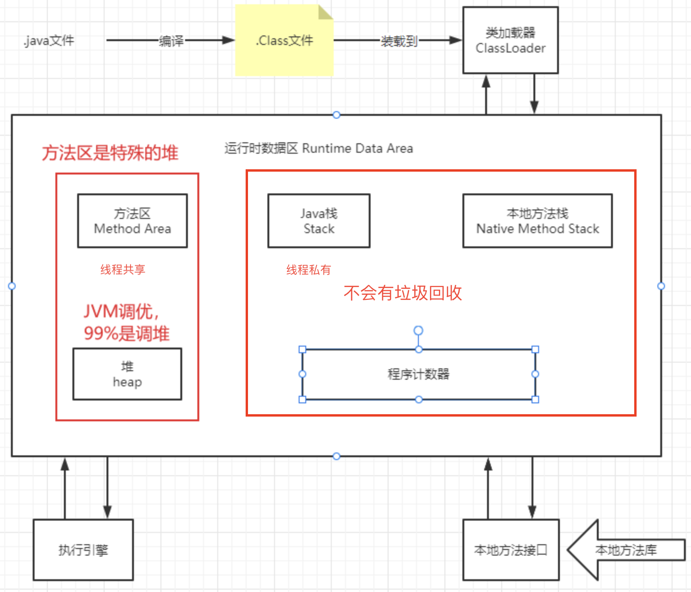

# 一、JVM

## 1、JVM位置

## 2、JVM体系结构

# 二、类加载器

## 1、类加载过程

## 2、类加载器的分类

1.  引导类加载器（BootstrapClassloader）：用C++编写，是JVM自带的类加载器；负责加载Java的核心类库。（该加载器无法直接获取）
2.  扩展类加载器（ExtClassloader）：负责加载/jre/lib/ext目录下的jar包。
3.  应用程序类加载器（AppClassloader）：负责加载java -classpath或-D java.class.path所指的目录下的类与jar包。（最常用的加载器）

## 3、双亲委派机制

1.  类加载器接收到一个加载请求时，他会委派给他的父加载器，实际上是去他父加载器的缓存中去查找是否有该类，如果有就加载返回，如果没有则继续委派给父类加载，直到顶层类加载器。
2.  如果顶层类加载器也没有加载该类，则会依次向下查找子加载器的加载路径，如果有就加载返回，如果都没有，则会抛出异常。

# 三、native 、方法区

## 1、native

使用native关键字的，说明Java的作用范围已经达不到了，它会去调用底层的C语言的库。

1.  进入本地方法栈。
2.  调用本地方法接口。Java在JVM内存区域专门开辟了一块标记区域Native Method Area Stack，用来登记native方法，通过JNI来加载本地方法库中的方法。

## 2、方法区

Method Area方法区（此区域属于共享区间，所有定义的方法的信息都保存在该区域）
方法区是被所有线程共享，所有字段、方法字节码、以及一些特殊方法（如构造函数，接口代码）也在此定义。

<u>**静态变量、常量、类信息（构造方法、接口定义）、运行时的常量池存在方法区中，但是实例变量存在堆内存中，和方法区无关。**</u>

static、final、class、常量池

## 3、PC寄存器

存储指向一条指令的地址

# 四、栈

栈内存，主管程序的运行，生命周期和线程同步；
线程结束，栈内存也就释放了，对于栈来说，**不存在垃圾回收问题**。

# 五、堆

一个JVM只有一个堆(栈是线程级的)，堆中存放类、方法、常量、变量，保存我们所有引用类型的真实对象。

## 1、新生区

## 2、永久区

这个区域是**常驻内存**的。
用来存放JDK自身携带的Class对象、Interface元数据，存储的是Java运行时的一些环境或类信息。
这个区域**不存在垃圾回收**。
关闭JVM虚拟机就会释放这个区域的内存。

什么情况下，在永久区就崩了？

-   一个启动类，加载了大量的第三方jar包。
-   Tomcat部署了太多的应用。
-   大量动态生成的反射类；不断的被加载，直到内存满，就会出现OOM

## 3、永久代和元空间

方法区是一种规范，不同的虚拟机厂商可以基于规范做出不同的实现，永久代和元空间就是出于不同jdk版本的实现。
方法区就像是一个接口，**永久代与元空间分别是两个不同的实现类**。
只不过永久代是这个接口最初的实现类，后来这个接口一直进行变更，直到最后彻底废弃这个实现类，由新实现类—元空间进行替代。

jdk1.8以及之后：在堆内存中，逻辑上存在，物理上不存在（元空间使用的是本地内存）

##  4、常量池

# 六、使用JPofiler工具分析OOM原因

# 七、GC垃圾回收

# 八、JMM内存模型