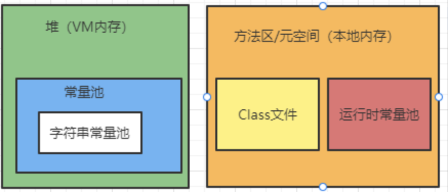

# 一、JVM

## 1、JVM基础概念

>   JDK、JRE、JVM的关系

JDK (Java开发工具包，包含了JRE和一些小工具，例如打包工具 jar.exe，编译工具javac.exe) > JRE (Java运行时环境，还包含一些Java的基本类库，想运行Java程序，安装JRE就够了) > JVM

## 2、JVM位置

## 3、JVM内存区域划分

方法区：存储虚拟机加载的类信息、常量、静态变量等

堆：存储对象实例及数组

栈：Java方法执行的内存模型

本地方法栈：与虚拟机栈类似，不过执行的是native本地方法

程序计数器：下一条需要执行的字节码指令 (JVM中占用内存最小)

## JVM中对象创建过程

# 二、类加载器

## 1、类加载过程

Class 文件由类装载器装载后，在JVM 中将形成一份描述Class 结构的元信息对象，通过该元信息对象可以获知Class 的结构信息：如构造函数、属性和方法等。

虚拟机把描述类的数据从 class 文件加载到内存，并对数据进行校验，转换解析和初始化，最终形成可以被虚拟机直接使用的Java 类型，这就是虚拟机的类加载机制。

加载 -- 验证 -- 准备 -- 解析 -- 初始化 (-- 使用 -- 卸载 )

## 2、类加载器的分类

1.  引导类加载器（BootstrapClassloader）：用C++编写，是JVM自带的类加载器；负责加载Java的核心类库。（该加载器无法直接获取）
2.  扩展类加载器（ExtClassloader）：负责加载/jre/lib/ext目录下的jar包。
3.  应用程序类加载器（AppClassloader）：负责加载java -classpath或-D java.class.path所指的目录下的类与jar包。（最常用的加载器）

## 3、双亲委派机制

1.  类加载器接收到一个加载请求时，他会委派给他的父加载器，实际上是去他父加载器的缓存中去查找是否有该类，如果有就加载返回，如果没有则继续委派给父类加载，直到顶层类加载器。
2.  如果顶层类加载器也没有加载该类，则会依次向下查找子加载器的加载路径，如果有就加载返回，如果都没有，则会抛出异常。

通过带有优先级的层级关可以避免类的重复加载；

保证Java 程序安全稳定运行，Java 核心 API定义类型不会被随意替换。

# 三、native 、方法区

## 1、native

使用native关键字的，说明Java的作用范围已经达不到了，它会去调用底层的C语言的库。

1.  进入本地方法栈。
2.  调用本地方法接口。Java在JVM内存区域专门开辟了一块标记区域Native Method Area Stack，用来登记native方法，通过JNI来加载本地方法库中的方法。

## 2、方法区

Method Area方法区（此区域属于共享区间，所有定义的方法的信息都保存在该区域）
方法区是被所有线程共享，所有字段、方法字节码、以及一些特殊方法（如构造函数，接口代码）也在此定义。

<u>**静态变量、常量、类信息（构造方法、接口定义）、运行时的常量池存在方法区中，但是实例变量存在堆内存中，和方法区无关。**</u>

static、final、class、常量池

## 3、PC寄存器

存储指向一条指令的地址

# 四、栈

栈内存，主管程序的运行，生命周期和线程同步；
线程结束，栈内存也就释放了，对于栈来说，**不存在垃圾回收问题**。

# 五、堆

一个JVM只有一个堆(栈是线程级的)，堆中存放类、方法、常量、变量，保存我们所有引用类型的真实对象。

## 1、新生区

## 2、永久区

这个区域是**常驻内存**的。
用来存放JDK自身携带的Class对象、Interface元数据，存储的是Java运行时的一些环境或类信息。
这个区域**不存在垃圾回收**。
关闭JVM虚拟机就会释放这个区域的内存。

什么情况下，在永久区就崩了？

-   一个启动类，加载了大量的第三方jar包。
-   Tomcat部署了太多的应用。
-   大量动态生成的反射类；不断的被加载，直到内存满，就会出现OOM

## 3、永久代和元空间

方法区是一种规范，不同的虚拟机厂商可以基于规范做出不同的实现，永久代和元空间就是出于不同jdk版本的实现。
方法区就像是一个接口，**永久代与元空间分别是两个不同的实现类**。
只不过永久代是这个接口最初的实现类，后来这个接口一直进行变更，直到最后彻底废弃这个实现类，由新实现类—元空间进行替代。

jdk1.8以及之后：在堆内存中，逻辑上存在，物理上不存在（元空间使用的是本地内存）

##  4、常量池

jdk1.8之后，HotSpot移除永久代，使用元空间代替；此时字符串常量池保留在堆中，运行时常量池保留在方法区中，只是实现不一样了，JVM内存变成了直接内存。

# 六、使用JPofiler工具分析OOM原因

# 七、GC垃圾回收

垃圾回收只在方法区和堆

低优先级，只有当 虚拟机空闲 或者 当前堆内存不足 时，才会触发

>   如何判断一个对象是否存活

引用计数法 or 可达性算法(引用链法)

>   常见垃圾回收算法

引用计数法

复制算法

标记-整理算法

分代收集算法

## 1、引用计数法

## 2、复制算法

-   好处：没有内存的碎片。
-   坏处：浪费了内存空间（多了一半空间to永远是空）。假设对象100%存活（极端情况），不适合使用复制算法。

## 3、标记清除压缩算法

可以进行多次标记清除，再进行一次压缩。

内存效率：复制算法>标记清除算法>标记压缩算法（时间复杂度）
内存整齐度：复制算法=标记压缩算法>标记清除算法
内存利用率：标记压缩算法=标记清除算法>复制算法

没有最好的算法，只有最合适的算法——》GC：分代收集算法

年轻代：

-   存活率低
-   复制算法

老年代：

-   区域大：存活率高
-   标记清除（内存碎片不是太多）+标记压缩混合实现

# 八、垃圾收集器

## 新生代垃圾收集器

>   Serial收集器

>   ParNew收集器

>   Parallel Scavenge收集器

## 老年代垃圾收集器

>   Serial Old 收集器

>Paralled Old 收集器

>   CMS收集器

## 其他

>   G1垃圾收集器

# 九、JMM内存模型

## 1. JMM是什么

JMM（Java Memory Model），Java的内存模型。

## 2. JMM的作用

缓存一致性的协议，用来定义数据读写的规则。

JMM定义了线程工作内存和主内存的抽象关系：线程的共享变量存储在主内存中，每个线程都有一个私有的本地工作内存。

使用volatile关键字来解决共享变量的可见性的问题。

Java内存模型是围绕着并发编程中**原子性、可见性、有序性**这三个特征来建立的。

## 3. JMM的操作

​       JMM定义了8种操作来完成（每一种操作都是原子的、不可再拆分的）。

-   lock（锁定）：作用于主内存的变量，它把一个变量标识为一条线程独占的状态。

-   unlock（解锁）：作用于主内存的变量，它把一个处于锁定状态的变量释放出来，释放后的变量才可以被其他线程锁定。

-   read（读取）：作用于主内存的变量，它把一个变量的值从主内存传输到线程的工作内存中，以便随后的load动作使用。

-   load（载入）：作用于工作内存的变量，它把read操作从主内存中得到的变量值放入工作内存的变量副本中。

-   use（使用）：作用于工作内存的变量，它把工作内存中一个变量的值传递给执行引擎（每当虚拟机遇到一个需要使用到该变量的值的字节码指令时将会执行这个操作）。

-   assign（赋值）：作用于工作内存的变量，它把一个从执行引擎接收到的值赋给工作内存的变量（每当虚拟机遇到一个给该变量赋值的字节码指令时执行这个操作）。

-   store（存储）：作用于工作内存的变量，它把工作内存中一个变量的值传送到主内存中，以便随后的write操作使用。

-   write（写入）：作用于主内存的变量，它把store操作从工作内存中得到的变量的值放入主内存的变量中。

    

##  4. JMM定义的规则

​        8种操作必须满足的规则：

-   不允许read和load、store和write操作之一单独出现。（不允许一个变量从主内存读取了但工作内存不接受；或者从工作内存发起回写了但主内存不接受的情况出现）
-   不允许一个线程丢弃它的最近的assign操作。（变量在工作内存中改变了值之后，必须把该变化同步回主内存）
-   不允许一个线程无原因地（没有发生过任何assign操作）把数据从线程的工作内存同步回主内存。
-   一个新的变量只能在主内存中“诞生”，不允许在工作内存中直接使用一个未被初始化（load或assign）的变量。（就是对一个变量实施use、store操作之前，必须先执行过了load和assign操作）
-   一个变量在同一时刻只允许一条线程对其进行lock操作，但lock操作可以被同一条线程重复执行多次，多次执行lock后，只有执行相同次数的unlock操作，变量才会被解锁。
-   如果对一个变量执行lock操作，那将会清空工作内存中此变量的值，在执行引擎使用这个变量前，需要重新执行load或assign操作初始化变量的值。
-   如果一个变量事先没有被lock操作锁定，那就不允许对它执行unlock操作，也不允许去unlock一个被其他线程锁定住的变量。
-   对一个变量执行unlock操作之前，必须先把此变量同步回主内存中（执行store、write操作）。

## 5. 并发编程的三大特性

### 1. 原子性

一个或多个程序指令，要么全部正确执行完毕不能被打断，或者全部不执行

### 2. 可见性

当一个线程修改了某个共享变量的值，其它线程应当能够立即看到修改后的值。

### 3. 有序性

程序执行代码指令的顺序应当保证按照程序指定的顺序执行，即便是编译优化，也应当保证程序源语一致。

# 6、题库

>   1、JVM 和 JDK 和 JRE的区别

Jdk包括了Jre和Jvm，Jre包括了Jvm
Jdk是我们编写代码使用的**开发工具包**
Jre 是Java的**运行时环境**，他大部分都是 C 和 C++ 语言编写的，他是我们在编译java时所需要的**基础的类库**