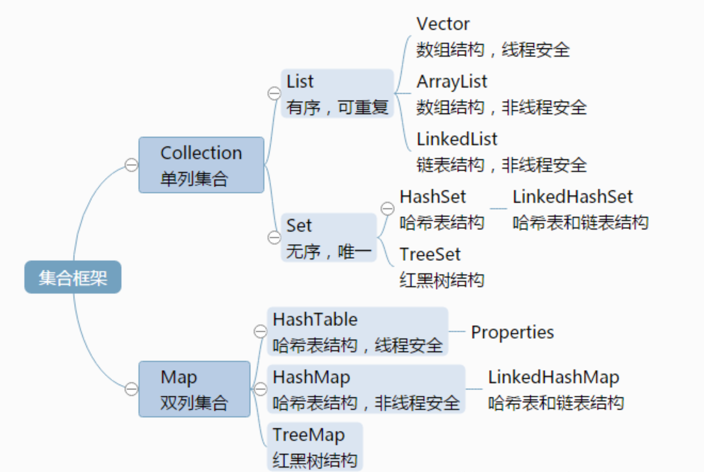

面向对象三大特性

-   封装
-   继承
-   多态

String StringBuffer StringBuilder的区别

# String

# 集合

集合存放数据对象引用，而非数据本身

有三种 List、Map、Set

# Java8

## Lamda表达式

## 方法引用

## 函数式接口

## 默认方法

## stream

## Optional类	

