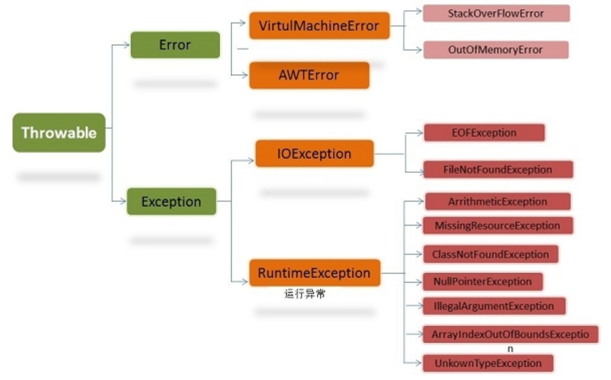
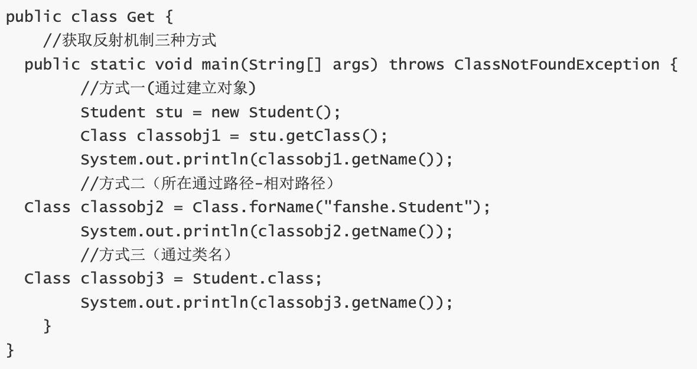

# 概述

>   Java语言的特点

1.   面向对象(易维护、易复用、易扩展) (面向过程：高性能，不需要实例化)

2.   平台无关性 (JVM)；
3.   健壮性(强类型机制、异常处理、垃圾自动回收)；
4.   安全性好；
5.   支持多线程（C++语言没有内置的多线程机制，因此必须调用操作系统的多线程功能来进行多线程程序设计，而 Java 语言却提供了多线程支持）；
6.   提供了对Web应用开发的支持
7.   编译与解释并存，是解释性语言；
8.   简单易学，功能强大(相较于C++，都是面向对象，但摒弃指针、多继承，有自动内存管理机制)

>   JDK 1.5后的三大版本

Java SE (标准版) 、 Java EE (企业版)、Java ME (微型版)

>   采用字节码(class文件，只面向虚拟机)的好处

Java语言通过字节码的方式（编译器 --> 解释器 --> 机器），在一定程度上解决了传统解释型语言执行效率低的问题，同时又保留了解释型语言可移植的特点。所以lava程序运行时比较高效，而且，由于字节码并不专对一种特定的机器，因此，Java程序无须重新编译便可在多种不同的计算机上运行。

>   Oracle JDK 和 OpenJDK的对比

-   前者3年发布一次，后者每三个月发布一次
-   前者不是完全开源，是后者的一个实现；后者完全开源，并且是一个参考模型
-   前者更加稳定
-   在响应性和JVM性能方面，前者性能更好
-   OracleJDK不会为即将发布的版本提供长期支持，用户每次都必须通过更新到最新版本获得支持来获取最新版本
-   OracleJDK根据二进制代码许可协议获得许可，而OpenJDK根据GPL v2许可获得许可。

>   Java应用程序 与 小程序之间的差别？主类又有什么区别

Java应用程序从主程序main()启动( JVM 在运行的时候会首先查找 main 方法 )，**主类**是指包含main()的类，不一定要求是public类。 在Java 7之前，你可以通过使用静态初始化运行 Java 类。但是，从Java 7 开始，没有 main 方法我们不能运行Java类。

main方法一定得是static的，这样JVM在调用它的时候才无需实例化

main可以重载，但不能被覆盖，作用域不能改变

main方法可以同步，synchronized 允许用于main方法的声明中

可以在Java中终结main方法

applet小程序主要嵌在浏览器页面运行(调用init()线程或者run()来启动)，**主类**是继承自系统类JApplet或者Applet的子类，要求必须是public

>   一个".java"源文件中是否可以包括多个类（不是内部类）？有什么限制 ？

可以，只有一个类是用public修饰

**没有人说过 Java 的 Class 名字必须和其文件名相同。但 public class 的名字必须和文件名相同**

>   JDK中常用的包

-   java.lang: 这个是系统的基础类
-   java.io: 这里面是所有输入输出有关的类，比如文件操作等
-   java.nio: 为了完善io包中的功能，提高 io 包中性能而写的一个新包
-   java.net: 这里面是与网络有关的类
-   java.util: 这个是系统辅助类，特别是集合类
-   java.sql: 这个是数据库操作的类

>   import java 和 import javax

最开始javax作为拓展，后面逐渐拓展成Java API的组成部分，没有区别了

>   字节序定义 以及 Java属于哪种字节序

字节序是指多字节数据在计算机内存中存储或网络传输时个字节的存储顺序

1.   小端：低位字节存放在内存的低地址端，高位字节存放在内存的高地址端

2.   大端：高位字节存放在内存的低地址端，低位字节存放在内存的高地址端

Java语言的字节序是大端

>   构造方法、成员变量初始化以及静态成员变量三者的初始化顺序

先后顺序：静态成员变量、成员变量、构造方法。 

详细的先后顺序：父类静态变量、父类静态代码块、子类静态变量、子类静态代码块、父类非静态变量、父类非静态代码块、父类构造函数、子类非静态变量、子类非静态代码块、子类构造函数。

>   Class对象

Java中对象可以分为实例对象和Class对象，每一个类都有一个Class对象，其包含了与该类有关的信息。 

获取Class对象的方法： 

-   Class.forName("类的全限定名”) 
-   实例对象.getClass()
-   类名.class

>   注解

Java 注解用于为 Java 代码提供元数据。作为元数据，注解不直接影响你的代码执行，但也有一些类型的注解实际上可以用于这一目的。

其可以用于提供信息给编译器，在编译阶段时给软件提供信息进行相关的处理，在运行时处理写相应代码，做对应操作。

>   元注解

元注解可以理解为注解的注解，即在注解中使用，实现想要的功能。其具体分为： 

-   @Retention：表示注解存在阶段是保留在源码，还是在字节码(类加载)或者运行期(JVM中运行)
-   @Target：表示注解作用的范围
-   @Documented：将注解中的元素包含到 Javadoc 中去
-   @Inherited：一个被@Inherited注解了的注解修饰了一个父类，如果他的子类没有被其他注解修饰，则它的子类也继承了父类的注解
-   @Repeatable：被这个元注解修饰的注解可以同时作用一个对象多次，但是每次作用注解又可以代表不同的含义

>   Object类常用方法

-   hashCode：通过对象计算出的散列码。用于map型或equals方法。 需要保证同一个对象多次调用该方法，总返回相同的整型值
-   equals： 判断两个对象是否一致。需保证equals方法相同对应的对象hashCode也相同
-   toString：用字符串表示该对象  
-   clone：深拷贝一个对象

>   重写equals不重写hashcode

在存储散列集合时，如果原对象.equals(新对象)，但没有对hashCode重写，即两个对象拥有不同的 hashCode，则在集合中将会存储两个值相同的对象，从而导致混淆。因此在重写equals方法时，必须重写hashCode 方法

>   故意构造相同的hash的字符串进行攻击如何处理

HashMap会动态的使用一个专门的treemap实现来替换掉它

>   Java中线程安全的基本数据结构

-   HashTable：哈希表的线程安全版，效率低 

-   ConcurrentHashMap：哈希表的线程安全版，效率高，用于替代HashTable 
-   Vector：线程安全版Arraylist 
-   Stack：线程安全版栈 
-   BlockingQueue及其子类：线程安全版队列

>   程序、进程、线程的关系

进程(动态)是程序(静态)的一次执行过程，是系统运行程序的基本单位，多个线程共享同一块内存空间和一组系统资源

>   获取键盘输入

~~~java
// 通过scanner
Scanner input = new Scanner(System.in);
String s = input.nextLine();
// 通过BufferedReader
BufferedReader input = new BufferedReader(new InputStreamReader(Syetem.in));
String s = input.readLine();
~~~

# 基础语法

## 数据类型

-   基本数据类型

-   引用数据类型：class interface 数组

基本数据类型在声明时系统会自动给它分配空间，而引用类型声明时只是分配了引用空间，必须通过实例化开辟数据空间之后才可以赋值。数组对象也是一个引用对象，将一个数组赋值给另一个数组时只是复制了一个引用，所以通过某一个数组所做的修改在另一个数组中也看的见

虽然定义了boolean这种数据类型，但是只对它提供了非常有限的支持。在Java虚拟机中没有任何供boolean值专用的字节码指令，Java语言表达式所操作的boolean值，在编译之后都使用Java 虚拟机中的int数据类型来代替，而boolean数组将会被编码成lava虚拟机的byte数组，每个元素 boolean元素占8位。这样我们可以得出boolean类型占了单独使用是4个字节，在数组中又是1个字节。使用int的原因是，对于当下32位的处理器（CPU）来说，一次处理数据是32位（这里不是指的 是32/64位系统，而是指CPU硬件层面），具有高效存取的特点

>   switch数据类型

在Java 5以前，switch(expr)中，expr 只能是 byte、short、char、int。从Java5 开始，Java中引入了枚举类型，expr 也可以是 enum 类型，从Java 7 开始，expr 还可以是字符串(String)， 但是**长整型(long)**在目前所有的版本中都是不可以的。

>   最有效率的2 乘 8

2 << 3

>   float f=3.4；是否正确

 不正确。3.4 是双精度数，将双精度型(double)赋值给浮点型(float)属于窄化，会造成精度损失，因此需要强制类型转换float f=(float)3.4；或者写成 float f=3.4F

>   short s1=1;s1 =s1+1 有错吗？short s1 =1;s1+=1 有错吗

1.   错。1是int类型，所以s1+1 也是int型，需要强制转换类型才能赋值给short型

2.   对。s1+=1 相当于 s1 = short(s1 + 1); 有隐含的强制类型转换

>   Java语言采取什么编码?有什么特点

Unicode(标准码)，为每个字符制订了一个唯一的数值，因此在任何的语言，平台，程序都可以使用

>   instanceof 

测试一个对象是否为一个类的实例；如果obj为null，return false；引用类型不能和基础类型比较

>   Integer 和 int 比较

如果Integer在-128到127之间，那么自动装箱时直接引用常量池中的对象

~~~java
Integer a = new Integer(3); // java9以后被移除了，应该使用Integer.valueof() 或者 自动装箱
Integer b = 3; // a != b
Integer a1 = 127;
Integer b1 = 127; // a == b
Integer a1 = 128;
Integer b1 = 128; // a != b
~~~

## 访问修饰符

private、protected不能修饰外部类，使用对象: 变量、方法

## 关键字

>   goto

goto是Java的保留字，没有使用

>   break跳出多重循环

可以在外面的循环语句前定义一个标号，然后在里层循环体的代码中使用带有标号的break 语句

>   final

-   类不可被**继承** 

-   方法不可被**重写** 

-   变量不可被**改变**，**不可变的是变量的引用，而不是引用指向的内容**

好处：final 关键字提高了性能，JVM 和 Java 应用都会缓存 final变量；final 变量可以安全的在多线程环境下进行共享，而不需要额外的同步开销；使用 final关键字，JVM 会对方法、变量及类进行优化

>   出现在Java程序中的finally代码块是否一定会执行？

当遇到下面情况不会执行。

1. 当程序在进入try语句块**之前就出现异常时**会直接结束
2. 当程序在try块中**强制退出时，如使用System.exit(0)**，也不会执行finally块中的代码

当try/catch语句块中有return时，finally语句块中的代码**会在return之前执行**。如果try/catch/finally块中都有return语句，finally块中的return语句**会覆盖try/catch模块中的return语句**。

>   finalize

finalize是一个方法，属于Object类的一个方法，而Object类是所有类的父类，该方法一般由垃圾回收器来调用，当我们调用System.gc()方法的时候，由垃圾回收器调用finalize()，回收垃圾，一个对象是否可回收的最后判断。

>   this, super

this可以引用本类中另一种形式的构造函数;super可以调用父类中的某一个构造函数

都需要为构造函数中的第一条，不能同时出现在同一个构造函数中，均不可以在static环境中使用

本质上，this是一个指向本对象的指针，super是一个java关键字

~~~java
public Person(String A, String B){
  this(A);
  this.B = B;
}
~~~

>   staitic

-   static的主要意义是在于创建独立于具体对象的域变量或者方法, 这些变量和方法被类的实例对象所共享

-   static关键字还有一个比较关键的作用就是 用来**形成静态代码块以优化程序性能**。static块可以置于类中的任何地方，类中可以有多个static块。在类初次被加载的时候，会按照static块的顺序来执行每个static块，并且只会执行一次 (初始化是在第一次使用的时候)

-   static不能被override

-   注意事项：1、静态只能访问静态。 2、非静态既可以访问非静态的，也可以访问静态的。

-   应用场景：1、修饰成员变量  2、修饰成员方法  3、静态代码块  4、修饰类【只能修饰内部类也就是静态内部 类】5、静态导包

## 泛型

>   概念

泛型，即“参数化类型”，解决不确定对象具体类型的问题。在编译阶段有效。在泛型使用过程中，操作的数据类型被指定为一个参数，这种参数类型在类中称为泛型类、接口中称为泛型接口和方法中称为泛型方法

>   泛型擦除

Java编译器生成的字节码是不包涵泛型信息的，泛型类型信息将在编译处理是被擦除，这个过程被称为泛型擦除

# 异常

Error 程序无法处理，大多数错误发生自JVM，非代码性错误，不受检

Exception可分为运行时异常和非运行(编译)时异常。对于运行时异常，可以利用try catch的方式进行处理，也可以不处理(JVM自动捕获抛出)。对于非运行时异常，必须处理(手动捕获)，不处理的话程序无法通过编译。

有时我们会从catch中抛出一个异常，目的是为了改变异常的类型。多用于在多系统集成时，当某个子系统故障，异常类型可能有多种，可以用统一的异常类型向外暴露，不需暴露太多内部异常细节

同一个 catch 也可以捕获多种类型异常，用|隔开

定义一个异常类应包含两个构造函数，一个无参构造函数和一个带有详细描述信息的构造 函数(Throwable 的toString方法会打印这些详细信息，调试时很有用)

>   Throwable 类常用方法

Throwable 包含了线程创建时线程执行堆栈的快照

-   public string getMessage()：返回异常发生时的详细信息
-   public string toString()：返回异常发生时的简要描述
-   public string getLocalizedMessage()：返回异常对象的本地化信息。使用 Throwable 的子类覆盖这个方法，可以声称本地化信息。如果子类没有覆盖该方法，则该方法返回的信息与 getMessage()返回的结果相同
-   public void printStackTrace()：在控制台上打印 Throwable 对象封装的异常信息

>   简述throw与throws的区别

throw用在方法体的内部，throws用于方法声明上

>   try-with-resource

finally 中的 close 方法也可能拋出lOException， 从而覆盖了原始异常。JAVA7提供 了更优雅的方式来实现资源的自动释放，自动释放的资源需要是实现了 **AutoCloseable** 接口的类

~~~java
try (Scanner scanner = new Scanner(new FileInputStream("..."),"UTF-8")) {
  //code
} catch (IOException e) {
  // handle exception
}
~~~

try 代码块退出时，会自动调用 scanner.close 方法，和把 scanner.close 方法放在 finally 代码块中不同的是，若scanner.close 抛出异常，**则会被抑制，抛出的仍然为原始异常**。被抑制的异常会由 addSusppressed 方法添加到原来的异常，如果想要获取被抑制的异常列表，可以调用 getSuppressed 方法来获取

>   NoClassDefFoundError 和 ClassNotFoundException 区别？

NoClassDefFoundError的原因是JVM或ClassLoader尝试加载某类时在内存中找不到该类的定义，该动作发生在运行期间，即编译时该类存在，但是在运行时却找不到了，可能是变异后被删除了等原因导致

ClassNotFoundException是受检异常。当使用 Class.forName, ClassLoader.loadClass 或 ClassLoader.findSystemClass 动态加载类到内存的时候，通过传入的类路径参数没有找到该类， 就会抛出该异常；另一种抛出该异常的可能原因是某个类已经由一个类加载器加载至内存中，另一 个加载器又尝试去加载它

>   try-catch-finally 中哪个部分可以省略

catch 可以省略。try只适合处理运行时异常，try+catch适合处理运行时异常+普通异常

>   异常处理最佳实践

1.   在finally块中清理资源或者使用try-with-resource语句
2.   优先明确的异常
3.   优先捕获最明确的异常
4.   用描述性信息抛出异常
5.   不要捕获Throwable类
6.   不要记录并抛出异常(不用log 而是 throw new exception("...",e))
7.   包装异常时不要忽略原始异常
8.   异常会影响性能

# 反射

>   反射机制的概念

在运行状态中对于任意一个类，都能够知道这个类的所有属性和方法；对于任意一个对象，都能够调用它的任意一个方法和属性；动态获取的信息以及动态调用对象的方法的功能

静态编译：在编译时确定类型，绑定对象。动态编译：运行时确定类型，绑定对象

>   反射机制的优缺点 

-   优点：运行期类型的判断，动态加载类，提高代码灵活度

-   缺点：性能瓶颈：反射相当于一系列解释操作，通知JVM要做的事情，性能比直接的java代码要慢很多。

>   反射机制的应用场景

框架设计(模块化开发; 动态代理设计模式; Spring/Hibernate等框架)

例子 JDBC Class.forName()加载数据库驱动程序;Spring 通过xml装载bean

>   获取反射的三种方式

1.通过new对象实现反射机制 2.通过路径实现反射机制 3.通过类名实现反射机制

-   Class类：可获得类属性方法 
-   Field类：获得类的成员变量 
-   Method类：获取类的方法信息 
-   Construct类：获取类的构造方法等信息

# 面向对象

>   三大特性

-   多态
-   封装：对象属性私有化
-   继承：子类拥有父类非private和非static 的属性和方法

抽象：数据抽象、行为抽象

>   多态

两种形式实现多态：继承(多个子类对同一方法的重写)和接口(实现接口并覆盖接口中同一方法)

多态分为编译时多态(重载，静态) 和运行时多态(重写，动态的，通过多态绑定实现)

多态的必要条件: 继承、重写、将子类的引用赋给父类

>   构造器 Constructor是否可以被Override

不可以，但可以被重载(参数列表不同)

子类返回值小于等于父类，抛出的异常小于等于父类，访问修饰符大于等于父类(里氏代换原则); 

如果父类方法访问修饰符为private则子类中就不是重写(子类都访问不到)

>   面向对象五大基本原则

-   单一职责原则
-   开放封闭原则：对拓展是开放的，对修改是封闭的
-   里氏替换原则：任何情况子类替换父类(必须实现父类的方法，实现输入参数可以放大，输出结果可以缩小)
-   依赖倒置原则：具体实现依赖于抽象
-   接口分离原则：将不同功能拆分成不同接口，接口要小而专

>   迪米特法则

又叫最少知识原则，一个对象应当对其他对象有尽可能少的了解

>   创建对象的方法

1.   new
2.   反射 Class.forName，newInstance
3.   clone
4.   反序列化

前两种使用构造器，后两种没用

## 类与接口

>   抽象类和接口

-   抽象类是用来捕捉子类的通用特性的。接口是抽象方法的集合。 

-   从设计层面来说，抽象类是对类的抽象，是一种模板设计，接口是行为的抽象，是一种行为的规范

-   都遵循"面向接口而不是实现编码"的设计原则

相同点：

-   接口和抽象类都不能实例化 
-   都位于继承的顶端，用于被其他实现或继承 
-   都包含抽象方法，其子类都必须覆写这些抽象方法

不同点：

**接口只能有方法定义，不能有方法的实现**，而抽象类可以有方法的定义与实现，但是抽象方法不能有方法体，private 和 abstract 不能同时出现。

**任何在 interface 里声明的 interface variable ，默认为 public static final**

Java8中接口中引入默认方法和静态方法，以此来减少抽象类和接口之间的差异。

当子类和父类有逻辑上的层次结构，推荐抽象类

行为模型优先选择接口

对象引用指向对象实例

抽象类不能用final修饰

>   为什么Java不支持多继承

1.   为了程序的结构能够更加清晰从而便于维护。假设Java语言支持多重继承，类C继承自类A和类B， 如果类A和B都有自定义的成员方法f()，那么当代码中调用类C的f()会产生二义性

2.   多重继承会使类型转换、构造方法的调用顺序变得复杂，会影响到性能。

>   普通类和抽象类

-   普通类不能包含抽象方法，抽象类可以包含抽象方法。 
-   抽象类不能直接实例化，普通类可以直接实例化。

## 变量与方法

成员变量有默认初始值；局部变量没有默认初始值，使用前必须赋值

>   在Java中定义一个不做事且没有参数的构造方法的作用

Java程序在执行子类的构造方法之前，如果没有用super()来调用父类特定的构造方法，则会**调用 父类中“没有参数的构造方法”**。因此，如果父类中只定义了有参数的构造方法，而在子类的构造方法中又没有用supe()来调用父类中特定的构造方法，则编译时将发生错误，因为Java程序在父类 中找不到没有参数的构造方法可供执行。解决办法是在父类里加上一个不做事且没有参数的构造方法。

## 内部类

>   分类

-   成员内部类

定义在成员位置上的非静态类，可以访问外部类所有的变量和成员

~~~java
public class outer {
  private int radius = 1;
  class Inner {
    ...
  }
}
Outer outer = new Outer();
Outer.Inner inner = Outer.new Inner()
~~~

-   局部内部类

定义在方法中的内部类。定义在实例方法中的局部类可以访问外部类的所有变量和方法，定义在静态方法中的局部类只能访问外部类的静态变量和方法。

-   匿名内部类

没有名字的内部类;只能使用一次

必须继承一个抽象类或者实现一个接口;

匿名内部类不能定义任何静态成员和静态方法;

当所在的方法的形参需要被匿名内部类使用时，必须声明为 final; 

(**原因:** 因为生命周期不一致，局部变量直接存储在栈中，当方法执行 结束后，非final的局部变量就被销毁。而局部内部类对局部变量的引用依然存在，如果局部内部类要调用局部变量时，就会出错。加了final，可以确保局部内部类使用的变量与外层的局部变量区分开，解决了这个问题。)

匿名内部类不能是抽象的，它必须要实现继承的类或者实现的接口的所有抽象方法。

-   静态内部类

静态内部类可以访问外部类所有的静态变量，但访问不了外部类的非静态变量

~~~java
public class Outer {
  ...
  static class staticInner {
    ...
  }
}

Outer.staticInner() Inner = new Outer.staticInner();
~~~

>   内部类优点

-   一个内部类对象可以访问创建它的外部类对象的内容，包括私有数据

-   内部类不为同一包的其他类所见，具有很好的封装性

-   内部类有效实现了"多重继承"，优化Java单继承的缺陷
-   匿名内部类可以很方便的定义回调

>   内部类应用场景

-   一些多算法场合 
-   解决一些非面向对象的语句块
-   适当使用内部类，使得代码更加灵活和富有扩展性
-   当某个类除了它的外部类，不再被其他的类使用时

## 对象相等判断

>   ==  、equals  和 hashCode

**==** 判断两个对象地址是否相同 (基础数据类型比较**值**，引用数据类型比较**内存地址**)

**equals**  当类覆盖了equals() 则比较两个对象的内容，否则比较两个对象，等价于 ==  (String里的 equals方法是比较对象中值，被重写过; Object是比较内存地址)

**hashCode**获取哈希吗(散列码)，定义在Object中

hashCode()的默认行为是对堆上面的对象产生独特值，如果没重写hashCode()，则该class的两个对象无论如何都不会相等

**对象的相等**比的是内存中存放的内容是否相等而**引用相等**比较的是他们指向的内存地址是否相等

## 值传递

>   为什么Java中只有值传递

按值调用(call by value)表示方法接收的是调用者提供的值，而按引用调用(call by reference)表示方法接收的是调用者提供的变量地址。**一个方法可以修改传递引用所对应的变量值，而不能修改传递值调用所对应的变量值**。

一个方法不能修改一个基本数据类型的参数，改变一个对象参数状态需要获取其对象引用的拷贝

引用传递传递的是变量对应的地址

# String

比较字符串的值是否相同用 equals，比较字符串对象是否同一个用==

每次+操作：隐式在堆上new了一个跟原字符串相同的StringBuilder对象，再调用append方法拼接+后面的字符

String>byte[] 通过 String类的 getBytes 方法；byte[]>String 通过 new String（byte[]）构造器

>   特性

不变性(不代表引用不可变，而且可以通过反射来修改)、常量池优化、final

>   字符型常量和字符串常量的区别

1.   形式上: 字符常量是单引号引起的一个字符，字符串常量是双引号引起的若干个字符 

2.   含义上: 字符常量相当于一个整形值(ASCII值)，可以参加表达式运算，字符串常量代表一个地址值(该字符串在内存中存放位置)

3.   占内存大小: 字符常量只占2个字节，字符串常量占若干个字节(至少一个字符结束标志)

>   String、StringBuffer、StringBuilder 有什么区别

三者都是final

String不可变，线程安全，适合操作少量数据

StringBuffer 是线程安全的(加了同步锁)，适合多线程操作字符缓冲区下操作大量数据

StringBuilder 线程不安全，速度较快，适合单线程操作字符缓冲区下操作大量数据

>   字符串常量池

字符串常量池位于堆内存中，专门用来存储字符串常量，可以提高内存的使用率，避免开辟多块空间存储相同的字符串，在创建字符串时JVM会首先检查字符串常量池，如果该字符串已经存在池中，则返回它的引用，如果不存在，则实例化一个字符串放到池中，并返回其引用。

>   String str = new String（"abc"）；创建了几个对象

创建了两个，“abc"本身创建在常量池，通过 new 又创建在堆中。String str = "i" 只分配到常量池

>   String str1 = "aaa"; String str2 =new String("aaa"); String str3 ="bbb"; String str4 = "aaabbb";
>
>   String str5 = "aaa" + "bbb" String str6 = str1 + "bbb"; String str7 = str2 + "ddd" + "eee";

str5创建了1个对象，因为由于`"aaa"`和`"bbb"`都是常量字符串，编译期会直接优化为`"aaabbb"`。此时会检查常量池，此时存在，所以只创建了一个对象

**str6创建了2个对象**，这种 "变量 + 常量" 的拼接，Java 无法在编译期完成优化，必须在**运行时**通过`StringBuilder`，处理过程如下：

1.  **创建`StringBuilder`对象**（第 1 个新对象）
    JVM 会自动实例化一个`StringBuilder`，用于执行拼接操作。
2.  **拼接并生成新`String`对象**（第 2 个新对象）
    -   先执行`append(str1)`（添加`"aaa"`）
    -   再执行`append("bbb")`（添加`"bbb"`）
    -   最后调用`StringBuilder.toString()`，在堆内存中生成一个新的`String`对象（内容为`"aaabbb"`）。
3.  最终`str6`引用的是堆中这个新生成的`String`对象，而非常量池中的`"aaabbb"`（即使`str4`已存在该常量）。

**str7创建了3个对象**，过程如下

1.  **编译期优化常量部分**
    首先，编译器会对连续的常量字符串进行合并：`"ddd" + "eee"`会被优化为`"dddeee"`（在常量池中新创建 1 个对象）。
2.  **运行时处理变量与优化后常量的拼接**
    剩余的`str2 + "dddeee"`包含变量`str2`，必须在运行时通过`StringBuilder`处理：
    -   第一步：创建`StringBuilder`对象（第 2 个新对象），用于拼接操作。
    -   第二步：调用`append(str2)`和`append("dddeee")`完成拼接后，执行`toString()`，在堆中生成新的`String`对象（内容为`"aaadddeee"`，第 3 个新对象）。

>   为什么要把String设计为不变量？

1. 节省空间: 字符串常量存储在JVM的字符串池中可以被用户共享
2. 提高效率: String会被不同线程共享，是线程安全的。在涉及多线程操作中不需要同步操作
3. 安全: String常被用于用户名、密码、文件名等使用，防止恶意修改

# 集合

## 集合框架

>   集合框架的优点

1.   使用核心集合类降低开发成本，而非实现我们自己的集合类
2.   随着使用经过严格测试的集合框架类，代码质量会得到提高
3.   通过使用JDK 附带的集合类，可以降低代码维护成本和学习新API成本
4.   复用性和可操作性
5.   可以方便地拓展或改写集合，提高代码复用性和可操作性

>   集合框架中的泛型的优点

1.   Java1.5 引入了泛型，所有的集合接口和实现都大量地使用它
2.   泛型允许我们为集合提供一个可以容纳的对象类型，因此，如果你添加其它类型的任何元素，它会在编译时报错
3.   这避免了在运行时出现 ClassCastException，因为你将会在编译时得到报错信息
4.   泛型也使得代码整洁，我们不需要使用显式转换和 instanceOf 操作符
5.   它也给运行时带来好处，因为不会产生类型检查的字节码指令

>   为什么Collection不从Cloneable 和 Serializable接口继承

如何维护元素由Collection的具体实现决定。在所有的实现中授权克隆和序列化，最终导致更少的灵活性和更多的限制。特定的实现应该决定它是否可以被克隆和序列化。

>   哪些集合类提供对元素的随机访问

ArrayList、HashMap、TreeMap、HashTable

>   哪些集合类是**线程安全**的

Vector、HashTable、Properties、Stack、ConcurrentHashMap

>   并发集合类概念

允许在迭代时修改集合，被设计成fail-fast。包括CopyOnWriteArrayList、 ConcurrentHashMap、CopyOnWriteArraySet

>   Comparable 和 Comparator接口区别

-   Comparable出自java.lang，提供方法compareTo，**内部比较器**接口，自然排序（一种）

~~~java
public class Student implements Comparable<Student> {
    private String name;
    private int age;
    
    @Override
    public int compareTo(Student other) {
        // 按年龄升序排序
        return this.age - other.age;
    }
}
// 使用时
List<Student> students = new ArrayList<>();
Collections.sort(students); // 直接排序，使用对象自身的比较规则
~~~

-   Comparator出自java.util，提供方法compare，**外部比较器**接口，定制排序（多种）

~~~java
// 为Student类创建按姓名排序的比较器
Comparator<Student> nameComparator = new Comparator<Student>() {
    @Override
    public int compare(Student s1, Student s2) {
        return s1.getName().compareTo(s2.getName());
    }
};
// 使用比较器排序
List<Student> students = new ArrayList<>();
Collections.sort(students, nameComparator); // 传入比较器
// Java 8+ 可以用Lambda表达式简化
students.sort((s1, s2) -> s1.getName().compareTo(s2.getName()));
~~~

>   如何保证一个集合不被修改？

在作为参数传递之前，我们可以使用 Collections.unmodifiableCollection(Collection c)方法创建一个只读集合， 这将确保改变集合的任何操作都会抛出 UnsupportedOperationException。

>   Collection 和 Collections区别

1.   Collection是一个集合接口，它提供了对集合对象进行基本操作的通用接口方法，所有集合都是它的子类，比如List、Set等
2.   Collections是一个包装类，包含了很多静态方法、不能被实例化，作为工具类使用，比如提供的排序方法： Collections.sort(list)；提供的反转方法：Collections.reverse(list)

## Iterator

所有的Collection都继承了Iterator

Iterator 不能保证迭代的顺序，其顺序完全由**底层集合的特性**决定

Iterator可以确保在当前遍历的集合元素被更改的时候，就会抛出 ConcurrentModificationException 异常。

Iterator 接口定义了遍历集合的方法，但它的实现则是集合实现类的责任。每个能够返回用于遍历的 Iterator 的集合类都有它自己的 Iterator 实现内部类。这就允许集合类去选择迭代器是 fail-fast 还是 fail-safe 的

>   Enumeration 和 Iterator接口的区别

Enumeration 的速度是 Iterator 的两倍，也使用更少的内存。Enumeration 是非常基础的，也满足了基础的需要。但是，与 Enumeration 相比，Iterator 更加安全，因当一个集合正在被遍历的时候，它会阻止其它线程去修改集合。 迭代器取代了 Java 集合框架中的 Enumeration。**迭代器允许调用者从集合中移除元素**，而 Enumeration 不能做到

>   Iterator 和 ListIterator 的区别

1.   Iterator 可以遍历 Set 和 List 集合，而 Listlterator 只能遍历 List
2.   Iterator 只能向前遍历，而 LIstlterator 可以双向遍历
3.   Listlterator 从 Iterator 接口继承，然后添加了一些额外的功能，比如添加一个元素、替换一个元素、获取前面或后面元素的索引位置

>   fail-fast和fail-safe选代器的区别是什么？

1.   fail-fast直接在容器上进行，在遍历过程中，一旦发现容器中的数据被修改，就会立刻抛出 **ConcurrentModificationException**异常(避免方式：使用并发集合类，例如CopyOnWriteArrayList)从而导致遍历失败。Collection中所有Iterator的实现都是按照fail-fast来设计的。java.util包下的集合类都是。

     机制：遍历过程中会使用一个变量modCount，集合内容变化会改变modCount的值。

     解决方案：1.在遍历过程中，所有涉及到改变modCount值得地方全部加上synchronized

      2.使用CopyOnWriteArrayList来替换ArrayList
2.   fail-safe这种遍历基于容器的一个克隆。因此对容器中的内容修改不影响遍历。常见的使用fail-safe 方式遍历的容器有ConcurrentHashMap 和 CopyOnWriteArrayList。java.util.concurrent包下的集合类都是。

>   如何边遍历边移除集合元素

~~~java
Iterator<integer> it = list.iterator();
while(it.hasNext()){
  it.remove();
}
/* 
不能直接list.remove(i)，因为会报ConcurrentModificationException异常。这是因为当使用foreach时，会自动生成一个iterator来遍历该list，但同时该list正在被 Iterator.remove()修改。Java一般不允许一个线程在遍历 Collection时另一个线程修改它。
*/
~~~

>   遍历List的几种方式

1、for  2、迭代器遍历  3、foreach循环遍历

支持RandomAccess 选择for 否则选择其他两个

查看源码我们发现实际上RandomAccess接口中什么都没有定义。所以，接口不过是一个标识，标识实现这个接口的类具有随机访问功能

在 binarySearch()方法中，它要判断传入的list是否 RamdonAccess 的实例，如果是，调用 indexedBinarySearch()方法，如果不是，那么调用 iteratorBinarySearch()方法

## List

List是可以包含重复元素的有序集合，提供按照索引访问

List (Array ->List : Arrays.asList 使用的是 final 数组，并且不支持add 方法，不支持扩容，不固定的可以使用new ArrayList(Arrays.asList(array))  ;  List -> Array : toArray)

-   ArrayList (数据结构：数组；迭代器实现是 fail-fast 的；允许null值；性能优于Vector；随机访问；顺序添加方便，删除和插入元素不方便(需要复制元素)；默认大小 JDK1.7之前为10，之后为0，每次扩容1.5)

-   LinkedList (数据结构：双向链表；相较于ArrayList消耗更多内存)

-   Vector(同ArrayList，但是线程安全，性能较差；其大部分方法是直接或间接同步的；每次扩容2倍；可以设置增长空间；不如ArrayList通用)

其他实现线程安全需要使用工具类Collections.synchronizedList(new ArrayList())

~~~java
List<String> synchronizedList = Collections.synchronizedList(list);
~~~

>   Array 和 ArrayList区别

Array 可以容纳基本类型和对象，而 ArrayList 只能容纳对象

Array 是指定固定大小的，而 ArrayList 大小是自由拓展的

Array 没有提供 ArrayList 那么多功能，比如 addAll、removeAll 和 iterator 等

Array更加合适的情况：

1.   如果列表的大小已经指定，大部分情况下是存储和遍历它们
2.   对于遍历基本数据类型，尽管 Collections 使用自动装箱来减轻编码任务，在指定大小的基本类型的列表上工作也会变得很慢
3.   如果你要使用多维数组，使用[ ] [ ]比 List<List<>>更容易

>   为什么 ArrayList 的 elementData 加上 transient 修饰

每次序列化时，先调用 defaultWriteObject()方法序列化 ArrayList 中的非 transient元素，然后遍历 elementData，只序列化已存入的元素，这样既加快了序列化的速度，又减小了序列化之后 的文件大小

## Map

>   为什么Map接口不继承Collection接口

尽管Map接口和它的实现也是集合框架的一部分，但Map不是集合。Map 包含 key-value 对，它提供抽取 key 或value 列表集合的方法。

>   三个集合视图

-   Keyset()
-   values()
-   entrySet()

都不支持add  和 addAll，支持移除

>   HashMap

基于哈希表的Map接口的非同步实现；允许使用null值和键，不保证映射的顺序

主要成员变量包括存储数据的table数组、元素数量size、加载因子loadFactor。 

键对应的 hash 值用来计算数组下标，如果hash 值一样，就会发生哈希冲突，被放到同一个链表上。

table 数组记录 HashMap 的数据，每个下标对应一条链表，所有哈希冲突的数据都会被存放到同一条链表(头插法)，Node/Entry 节点包含四个成员变量：key、value、next 指针和 hash 值。**在JDK8后链表(尾插法)超过8会转化为红黑树**(查询效率从O(n)到O(logn))。 若当前数据/总数据容量>负载因子，Hashmap将执行扩容操作。 默认初始化容量为16，扩容容量必须是2的幂次方、最大容量为1<<30、默认加载因子为 0.75。

JDK8还解决了多线程死循环问题，但依旧非线程安全

>   为什么HashMap线程不安全

在JDK1.7中，HashMap采用头插法插入元素，因此并发情况下会导致环形链表，产生死循环。 

虽然JDK1.8采用了尾插法解决了这个问题，但是并发下的put操作也会使前一个key被后一个key覆盖。 

由于HashMap有扩容机制存在，也存在A线程进行扩容后，B线程执行get方法出现失误的情况。

>   HashMap 和 Hashtable的区别

1.   HashMap是Hashtable的轻量级实现(效率更高)，HashMap**允许**key和value为null，而HashTable**不允许**
2.   HashTable中的方法是**线程安全**的，而HashMap不是(适合单线程)。在多线程访问HashMap需要提供额外的同步机制
3.   Hashtable使用Enumeration进行遍历(不支持fail-fast)，HashMap使用Iterator进行遍历(支持fail-fast)
4.   Hashtable遍历顺序不可知; 在Java1.4 中引入了 LinkedHashMap, HashMap 的一个子类, 假如你想要遍历顺序，你很容易从 HashMap 转向 LinkedHashMap
5.   HashTable 是遗留类，如果你寻求在迭代的时候修改 Map，你应该使用**CocurrentHashMap**
6.   初始容量和每次扩容大小不同，Hashtable初始11，扩容2n+1; HashMap初始16，扩容2n
7.   HashTable继承Dictionary类，HashMap继承AbstactMap类

>   TreeMap

TreeMap是底层利用红黑树实现的Map结构，底层实现是一棵平衡的排序二叉树，由于红黑树的插入、 删除、遍历时间复杂度都为O(logN)，所以性能上低于哈希表。但是**哈希表无法提供键值对的有序输出，红黑树可以按照键的值的大小有序输出**; 线程非同步;适合对key集合有序遍历的场景。可以在声明的时候自定义Comparator

>   TreeMap 和 TreeSet 在排序时如何比较元素

TreeSet 要求存放的对象所属的类必须实现Comparable 接口，当插入元素时会回调该方法比较元素的大小。TreeMap 要求存放的键值对映射的键必须实现 Comparable 接口从而根据键对元素进行排序

>   String和Integer这样的包装类做key的好处

HashMap 内部实现是通过key的hashcode 来确定 value 的存储位置，因为其不可变性， 所以当创建字符串时，它的hashcode 被缓存下来，不需要再次计算，所以相比于其他对象更快。并且其内部已经**重写equals和hashcode**(作为key的必要条件)，符合HashMap内部的规范

>   HashMap为什么不直接使用hashCode()处理后的哈希值直接作为table的下标？

int值范围大于HashMap容量范围，导致hash值可能无法匹配到存储位置。

1.   HashMap自己实现了自己的 hash()方法，通过**两次扰动**(加大哈希值低位的随机性，使得分布更均匀，从而提高对应数组存储下标位置的随机性和均匀性，最终减少Hash冲突)使得它自己的哈希值高低位自行进行**异或**运算，降低哈希碰撞概率也使得数据分布更平均

2.   保证数组长度为2的幂次方。这样一来是比取余操作更加有效率，二来因为只有当数组长度为2的幂次方时，**h&(length-1)才等价于h%length**，三来解决了"哈希值与数组大小范围不匹配”的问题

>   ConcurrentHashMap

get 除读到空值不需要加锁。该方法先经过一次再散列，再用这个散列值通过散列运算定位到 Segment，最后通过散列算法定位到元素

put须加锁，首先定位到 Segment，然后进行插入操作，第一步判断是否需要对 Segment 里的 HashEntry 数组进行扩容，第二步定位添加元素的位置，然后将其放入数组

JDK8的改进

1.   取消分段锁机制，采用CAS算法进行值的设置，如果CAS失败再使用 synchronized 加锁添加元素
2.   引入红黑树结构，当某个槽内的元素个数超过8且 Node数组 容量大于 64时，链表转为红黑树
3.   使用了更加优化的方式统计集合内的元素数量。

>   HashMap 和 ConcurrentHashMap 的区别 

1.   ConcurrentHashMap对整个桶数组进行了分割分段(Segment)，然后在每一个分段上都用lock锁进行保护，相对于HashTable的synchronized锁的粒度更精细了一些，并发性能更好，而 HashMap没有锁机制，不是线程安全的
2.   HashMap的键值对允许有null，但是ConCurrentHashMap都不允许

>   ConcurrentHashMap 和 Hashtable 的区别

1.   底层数据结构：ConcurrentHashMap 1.7 分段数组+链表，1.8数组+链表/红黑树；Hashtable 数组+链表
2.   实现线程安全的方式：ConcurrentHashMap 1.7使用分段锁；1.8使用Node数组 + 链表 + 红黑树，并发控制使用synchronized和CAS来操作; HashTable 是直接对整个结构都上锁

>   LinkedHashMap的实现原理

LinkedHashMap也是基于 HashMap 实现的，不同的是它定义了一个Entry header，这个header不是放在 Table 里，它是额外独立出来的

LinkedHashMap 通过继承 hashMap 中的 Entry， 并添加两个属性 Entry before,after，和 header 结合起来组成一个双向链表，来实现按插入顺序或访问顺序排序。LinkedHashMap 定义了排序模式 accessOrder，该属性为 boolean 型变量，对于访问顺序，为 true ；对于插入顺序，则为 false。一般情况下，不必指定排序模式，其迭代顺序即为默认为插入顺序

## Set

List支持for，但Set只支持迭代

Set即集合，该数据结构不允许元素重复且无序。Java对Set有三种实现方式:

-   HashSet 通过 HashMap实现，HashMap的Key即为HashSet存储的元素，Value统一为PRESENT的 Object 类型常量。判断元素是否相同时，先比较hashCode，相同后再利用equals比较，查询O(1) 
    Add调用HashMap的put方法

-   LinkedHashSet继承自 HashSet，通过 LinkedHashMap 实现，使用双向链表维护元素插入顺序。 
-   TreeSet 通过 TreeMap 实现的，底层数据结构是**红黑树**，添加元素到集合时按照比较规则将其插入合适的位置，保证插入后的集合仍然有序。查询O(logn)

# IO流

>   IO流分类

-   按照流的流向分，可以分为输入流和输出流

-   按照操作单元划分，可以划分为字节流(FileInputStream)和字符流(FileReader)
-   按照流的角色划分为节点流和处理流
-   InputStream/Reader：所有的输入流的基类，前者是字节输入流，后者是字符输入
-   OutputStream/Writer：所有输出流的基类，前者是字节输出流，后者是字符输出流

>   BIO. NIO. AIO 的区别

-   BIO:Block IO 同步阻塞式，就是我们平常使用的传统IO，它的特点是模式简单使用方便，并发处理能低 
-   NIO: Non IO 同步非阻塞，是传统IO的升级，客户端和服务器端通过 **Channel(通道)**通讯，实现了多路复用。 面向缓存
-   AIO: Asynchronous IO 异步非阻塞，是 NIO 的升级，也叫 NIO2，异步IO的操作基于**事件和回调机制**

>   多路复用

# 序列化

序列化：将java对象转化为字节序列，由此可以通过网络对象进行传输

反序列化：将字节序列转化为java对象

具体实现：实现Serializable接口，或实现Externalizable接口中的witeExternal() 与readExternal()方法

不想序列化: 使用transient关键字(只能修饰变量，不能修饰类和方法)

# Java8

## Lamda表达式

## 方法引用

## 函数式接口

## 默认方法

java8中接口页可以定义方法了(default method)

## stream

## Optional类	

