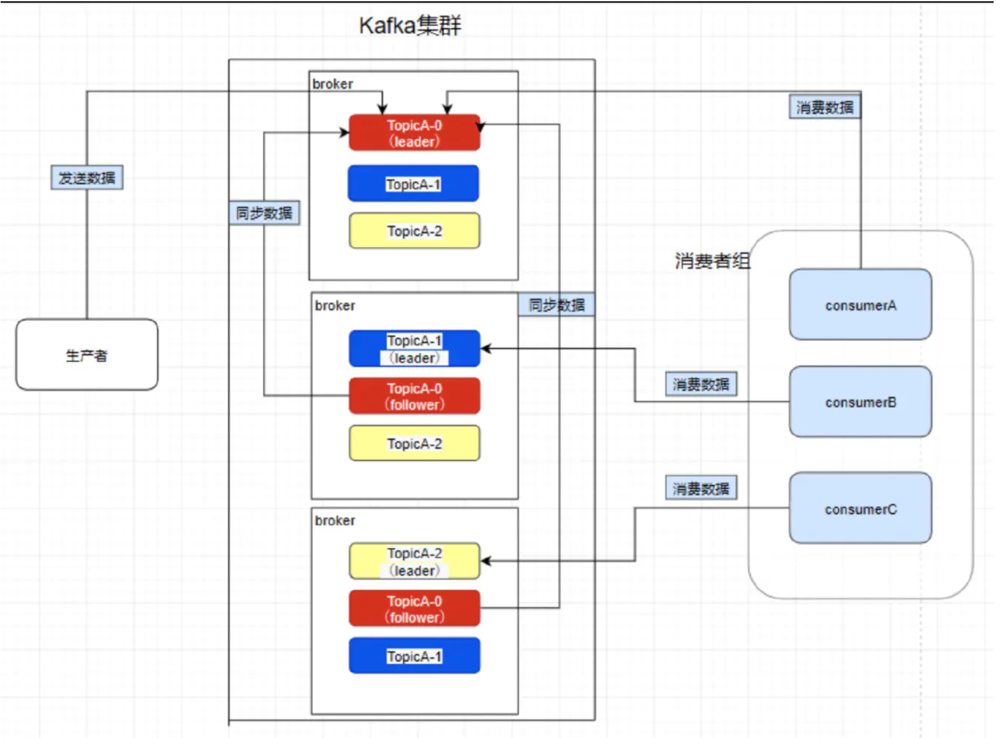

# 简介

Apache Kafka是一个分布式发布-订阅消息系统和一个强大的队列。适合离线和在线消息消费，Kafka消息保留在磁盘上，并在群集内复制以防止数据丢失。Kafka构建在ZooKeeper同步服务之上。它与Apache Storm 和Spark非常好地集成，用于实时流式数据分析。

Kafka 依赖于日志顺序写，因此支持消息回溯和支撑高性能读写

依赖Zookeeper

# 架构

# 基本概念

>   Broker

>   Topic

>   Partition

>   Replica

>   ISR

>   水印备份机制

>   Message

>   Producer

>   数据一致性保证(消息不丢失)

>   Consumer

>   Consumer Group

# 分片规则

# Rebalance

>   Coordinator

>   触发条件

>   Rebalance流程

>   如何避免Rebalance

# 日志索引

# 高性能、高吞吐