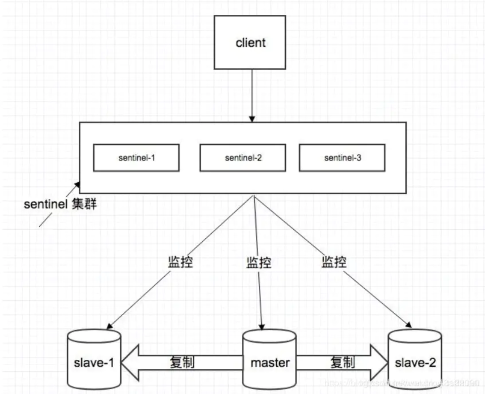
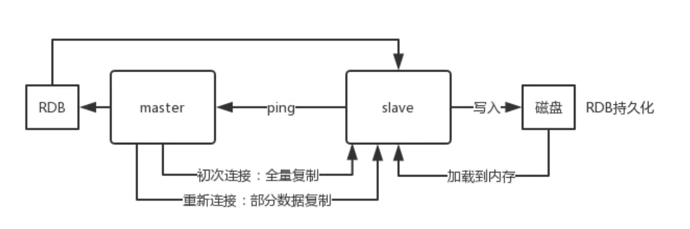
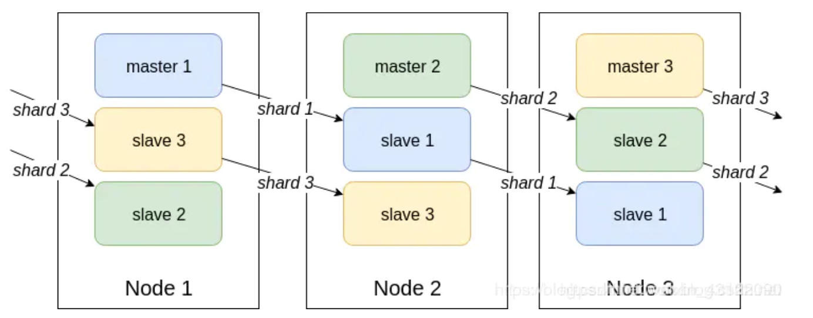
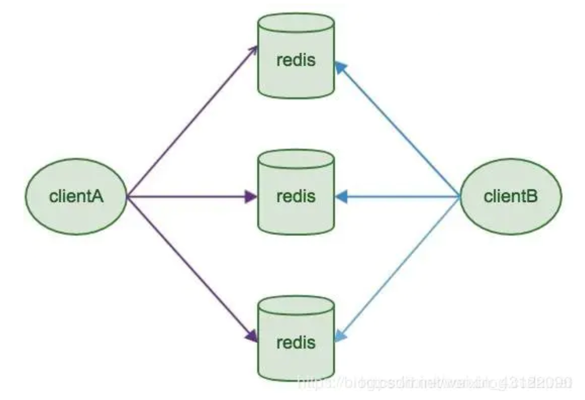
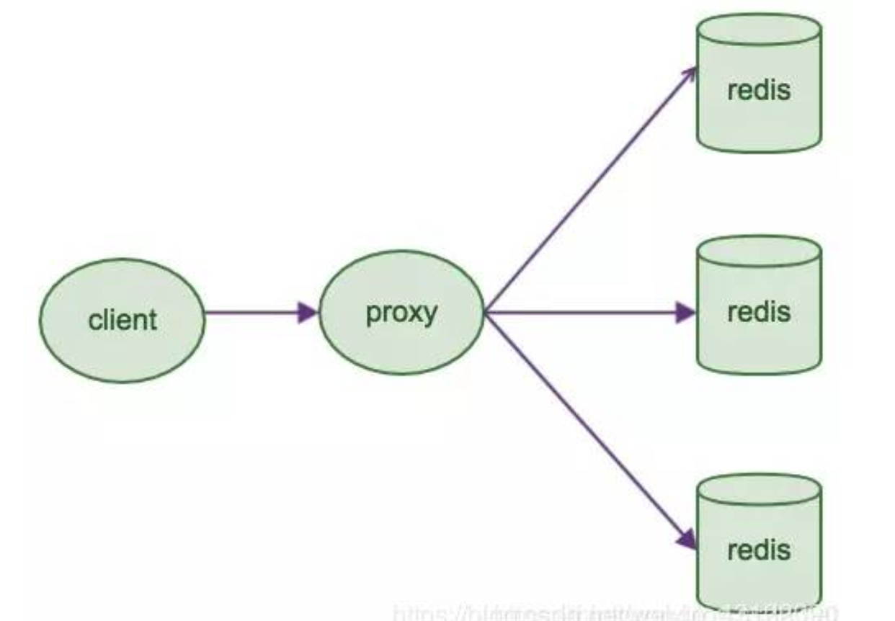

# 概述

>   Redis概念

Remote Dictionay Server；C语言写的，key-value型非关系型、内存数据库；redis是nosql单线程，但是可处理1秒10w的并发。定期通过异步操作把数据库数据flush 到硬盘上进行保存。支持的Java客户端：Jedis、Redisson(推荐)、lettuce

>   Redis优缺点

-   优点 

    读写性能优异

    支持数据持久化，支持AOF和RDB两种持久化方式

    支持事务，Redis的所有操作都是原子性的，还支持对几个操作合并后的原子性执行

    数据结构丰富

    支持主从复制(数据备份)，主机会自动将数据同步到从机，可以进行读写分离

    丰富的特性：发布/订阅，通知，key过期，缓存

    高并发(一部分请求直接到缓存而不经过数据库)

-   缺点 

    数据库容量受到物理内存的限制，主要局限在较小数据量的高性能操作和运算上

    Redis 不具备自动容错和恢复功能，主机从机的宕机都会导致前端部分读写请求失败，需要 等待机器重启或者手动切换前端的IP才能恢复

    主机宕机，宕机前有部分数据未能及时同步到从机，切换IP后还会引入数据不一致的问题， 降低了系统的可用性

    Redis 较难支持在线扩容，在集群容量达到上限时在线扩容会变得很复杂。为避免这一问题，运维人员在系统上线时必须确保有足够的空间，这对资源造成了很大的浪费

>   为什么要用 Redis 而不用 map/guava做缓存

-   缓存分为本地缓存和分布式缓存。以Java 为例，使用自带的 map 或者 guava 实现的是本地缓存，最主要的特点是轻量以及快速，生命周期随着jvm的销毁而结束，并且在多实例的情况下， 每个实例都需要各自保存一份缓存，缓存不具有一致性
-   使用redis 或 memcached 之类的称为分布式缓存，在多实例的情况下，各实例共用一份缓存数据，缓存具有一致性。缺点是需要保持 redis 或memcached服务的高可用，整个程序架构上较为复杂

>   Memcached

完全基于内存缓存的
节点之间相互独立
C/S 模式架构，C 语言编写，总共 2000 行代码。
异步 I/O 模型，使用 libevent 作为事件通知机制。
被缓存的数据以 key/value 键值对形式存在的。
全部数据存放于内存中，无持久性存储的设计，重启服务器，内存里的数据会丢失。
当内存中缓存的数据容量达到启动时设定的内存值时，就自动使用 LRU 算法 删除过期的缓存数据。
可以对存储的数据设置过期时间，这样过期后的数据自动被清除，服务本身 不会监控过期，而是在访问的时候查看 key 的时间戳，判断是否过期。
memcache 会对设定的内存进行分块，再把块分组，然后再提供服务。

>   Redis和mencached的区别

1.   memcached 只支持字符串
2.   redis的速度更快
3.   Memecache 把数据全部存在内存之中，断电后会挂掉，数据不能超过内存大小。 Redis 有部份存在硬盘上，这样能保证数据的持久性
4.   底层实现方式以及与客户端之间通信的应用协议不一样。 Redis 直接自己构建了VM 机制，因为一般的系统调用系统函数的话，会浪费一定的时间去移动和请求
5.   value大小：redis 最大可以达到 1GB，而 memcache 只有1MB

>   Redis和其他key-value存储的不同

Redis 有着更为复杂的数据结构并且提供对他们的原子性操作，这是一个不同于其他数据库的进化路径。Redis 的数据类型都是基于基本数据结构的同时对程序员透明，无需进行额外的抽象

Redis 运行在内存中但是可以持久化到磁盘，所以在对不同数据集进行高速读写时需要权衡内存，因为数据量不能大于硬件内存。在内存数据库方面的另一个优点是，相比在磁盘上相同的复杂的数据结构， 在内存中操作起来非常简单，这样 Redis 可以做很多内部复杂性很强的事情。同时，在磁盘格式方面他们是紧凑的以追加的方式产生的，因为他们并不需要进行随机访问

>   为什么redis快

1.   数据存于内存

2.   多路I/O复用，非阻塞型IO 
3.   单线程，避免了不必要的上下文切换和竞争条件，也不存在多进程或者多线程导致的切换 而消耗CPU，不用去考虑各种锁的问题，不存在加锁释放锁操作，没有因为可能出现死锁而导致的性能消耗。利用队列技术将并发访问变为串行访问，消除了传统数据库串行控制的开销。
4.   数据结构简单，操作也简单

>   Redis支持的数据类型

String value最大容量512M；应用场景：1. 存储json 类型对象 2. 计数器  3.视频点赞

List  应用场景：1.可以使用 redis 的 list 模拟队列，堆，栈  2.朋友圈点赞(一条朋友圈内容语句，若干点赞语句)

Set

ZSet有序数组

Hash 应用场景：1.保存对象 2.分组

>   Redis适合的场景

1.   会话缓存(Session Cache) 

2.   全页缓存(FPC)

     除基本的会话token 之外，Redis 还提供很简便的FPC平台。回到一致性问题，即使重启了 Redis 实例，因为有磁盘的持久化，用户也不会看到页面加载速度的下降，这是一个极大改进，类似PHP 本地FPC 

3.   提供 list 和 set 操作，能作为消息队列平台

4.   排行榜/计数器(String)  Redis 在内存中对数字进行递增或递减的操作实现的非常好。集合和有序集合使得我们在执行这些操作的时候变的非常简单，Redis 只是正好提供了这两种数据结构。 Set也所以，我们要从排序集合中获取到排名最靠前的10个用户 我们称之为“user_scores”，我们只需要像下面一样执行即可： 当然，这是假定你是根据你用户的分数做递增的排序。如果你想返回用户及用户的分数，你需要这样执行： 

     ZRANGE user_scores 0 10 WITHSCORES

5.   发布/订阅功能

6.   查找表 例如DNS记录就很适合使用 Redis 进行存储。查找表和缓存类似，也是利用了 Redis 快速的查找特 性。但是查找表的内容不能失效，而缓存的内容可以失效，因为缓存不作为可靠的数据来源

7.   分布式锁 sent 和 RedLock

>   Redis 是单线程的，如何提高多核CPU 的利用率

可以在同一个服务器部署多个 Redis 的实例(一个Redis实例最多2的32次方个keys，存储极限是系统的的可用内存值)，并把他们当作不同的服务器来使用，在某些时候，无论如何一个服务器是不够的， 所以，如果你想使用多个 CPU，你可以考虑一下分片（shard）

>   Redis使用情况和状态查看

Info

>   都有哪些办法可以降低 Redis的内存使用情况呢

如果你使用的是32位的 Redis 实例，可以好好利用 Hash, list,sorted set,set 等集合类型数据， 因为通常情况下很多小的Key-Value 可以用更紧凑的方式存放到一起

>   Redis和Redission的关系

Redisson 是一个高级的分布式协调 Redis 客服端，能帮助用户在分布式环境中轻松实现一些 Java 的对象

>   Jedis和Redission的对比

Jedis 是Redis 的Java 实现的客户端，其API 提供了比较全面的 Redis 命令的支持

Redisson 实现了分布式和可扩展的Java 数据结构，和Jedis相比，功能较为简单，不支持字符串操作，不支持排序、事务、管道、分区等Redis 特性。Redisson 的宗旨是促进使用者对 Redis 的关注分离，从而让使用者能够将精力更集中地放在处理业务逻辑上

>   支持一致性哈希的客户端

Redis-rb、PRedis

>   Redis如何设置密码和验证密码

设置密码：config set requirepass 123456

授权密码：auth 123456

>   怎么测试Redis的连通性

ping

>   Redis的管道

一次请求/响应服务器能实现处理新的请求即使旧的请求还未被响应。这样就可以将多个命令发送到服务器，而不用等待回复，最后在一个步骤中读取该答复。 

这就是管道（pipelining），是一种几十年来广泛使用的技术。例如许多 POP3协议已经实现支持这个功能，大大加快了从服务器下载新邮件的过程

>   pipeline的好处

可以将多次IO往返的时间缩减为一次，前提是 pipeline 执行的指令之间没有因果相关性。使用 redis-benchmark 进行压测的时候可以发现影响 redis 的 QPS 峰值的一个重要因素是 pipeline 批次指令的数目。

>   Redis如何做到大量数据插入

Redis2.6 开始Redis-cli 支持一种新的被称之为 pipe mode 的新模式用于执行大量数据插入工作

>   Redis Key的过期时间和永久有效设置

EXPIRE 和 PERSIST 命令

>   Redis常见性能问题和解决方案

1.   Master 写内存快照，save 命令调度 rdbSave 函数，会阻塞主线程的工作， 当快照比较大时对性能影响是非常大的，会间断性暂停服务，所以 Master 最好不要写内存快照。Master AOF 持久化，如果不重写 AOF 文件，这个持久化方式对性能的影 响是最小的，但是 AOF 文件会不断增大，AOF 文件过大会影响 Master 重启的恢复速度。Master 最好不要做任何持久化工作，包括内存快照和 AOF 日志文件，特别是不要启用内存快照做持久化，如果数据比较关键， 某个 Slave 开启 AOF 备份数据，策略为每秒同步一次。如果数据比较重要，某个 Slave 开启 AOF 备份数据，策略设置为每秒同步一次
2.   Master 调用 BGREWRITEAOF 重写 AOF 文件，AOF 在重写的时候会占大 量的 CPU 和内存资源，导致服务load 过高，出现短暂服务暂停现象
3.   为了主从复制的速度和连接的稳定性，Master 和 Slave 最好在同一个局域网内
4.   尽量避免在压力很大的主库上增加从库
5.   主从复制不要用图状结构，用单向链表结构更为稳定，即：Master <- Slavel <- Slave2 <- Slave3  这样的结构方便解决单点故障问题，实现 Slave 对 Master 的替换。如果 Master 挂了，可以立刻启用 Slavel 做Master，其他不变

>   修改配置不重启 Redis 会实时生效吗

针对运行实例，有许多配置选项可以通过 CONFIG SET 命令进行修改，而无需执行任何形式的重启。从 Redis 2.2 开始，可以从 AOF 切换到 RDB 的快照持久性或其他方式而不需要重启 Redis。检索‘CONFIG GET*’命令获取更多信息。 但偶尔重新启动是必须的，如为升级 Redis程序到新的版本，或者当你需要修改某些目前CONFIG 命令还不支持的配置参数的时候

# 核心功能

>   数据持久化

-   RDB(默认) 、在指定的时间间隔能对数据进行快照存储

RDB 持久化原理：通过 bgsave命令触发，然后父进程执行 fork操作创建子进程，子进程创建 RDB文件，根据父进程内存生成临时快照文件，完成后对原有文件进行原子替换（定时一次性将所有数据进行快照生成一份副本存储在硬盘中）

优点：只有一个dump.rdb，方便持久化；容灾性能更好，文件可以保存到安全的磁盘；性能最大化，fork 子进程来完成写操作，让主进程继续处理命令，所以是I/O最大化。使用单独子进程来进行持久化，主进程不会进行任何I/O操作，保证了redis 的高性能；相对于数据集大时，比 AOF的启动效率更高；是一个紧凑压缩的二进制文件，Redis 加载RDB 恢复数据远远快于 AOF 的方式

缺点：由于每次生成 RDB开销较大，非实时持久化

数据安全性低。RDB 是间隔一段时间进行持久化，如果持久化之间 redis 发生故障，会发生数据丢失。所以这种方式更适合数据要求不严谨的时候

-   AOF 持久化方式记录每次对服务器写的操作，当服务器重启的时候会重新执行这些命令来恢复原始的数据，AOF 命令以 Redis 协议追加保存每次写的操作到文件末尾。Redis 还能对 AOF 文件进行后台重写，使得AOF 文件的体积不至于过大

AOF 持久化原理：开启后，Redis 每执行一个修改数据的命令，都会把这个命令添加到 AOF 文件中

优点：实时持久化；数据安全，aof 持久化可以配置 appendfsync属性，有 always，每进行一次命令操作就记录到 aof 文件中一次；通过 append 模式写文件，即使中途服务器宕机，可以通过 redis-check-aof 工具解决数据一致性问题；AOF机制的 rewrite 模式。AOF 文件没被 rewrite 之前（文件过大时会对命令进行合并重写），可以删除其中的某些命令（比如误操作的flushall））

缺点：所以 AOF 文件体积逐渐变大，需要定期执行重写操作来降低文件体积，加载慢；AOF 文件比 RDB文件大，且恢复速度慢；数据集大的时候，比rdb 启动效率低

你也可以同时开启两种持久化方式，在这种情况下，当Redis 重启的时候会优先载入AOF 文件来恢复原始的数据，因为在通常情况下AOF 文件保存的数据集要比 RDB文件保存的数据集要完整

AOF文件比RDB更新频率高，优先使用AOF还原数据。 AOFLRDB更安全也更大 RDB性能比AOF好

>   如何选择合适的持久化方式

一般来说，如果想达到足以媲美 PostgreSQL 的数据安全性，你应该同时使用两种持久化功能。如果你非常关心你的数据，但仍然可以承受数分钟以内的数据丢失，那么你可以只使用 RDB 持久化

有很多用户都只使用AOF 持久化，但并不推荐这种方式：因为定时生成RDB 快照 （snapshot）非常便于进行数据库备份，并且 RDB 恢复数据集的速度也要比 AOF 恢复的速度要快，除此之外，使用RDB 还可以避免之前提到的AOF 程序的bug

>   Redis线程模型

Redis基于Reactor模式开发了网络事件处理器，这个处理器被称为文件事件处理器 （file event handler）。它的组成结构为4部分：多个套接字、IO多路复用程序、文件事件分派器、事件处理器。因为文件事件分派器队列的消费是单线程的，所以Redis才叫单线程模型

-   文件事件处理器使用IO多路复用（multiplexing）程序来同时监听多个套接字，并根据套接字目前执行的任务来为套接字关联不同的事件处理器
-   当被监听的套接字准备好执行连接应答（accept）、读取（read）、写入（write）、关闭 （close）等操作时，与操作相对应的文件事件就会产生，这时文件事件处理器就会调用套接字之前关联好的事件处理器来处理这些事件

虽然文件事件处理器以单线程方式运行，但通过使用I/O多路复用程序来监听多个套接字，文件事件处理器既实现了高性能的网络通信模型，又可以很好地与 redis 服务器中其他同样以单线程方式运行的模块进行对接，这保持了 Redis 内部单线程设计的简单性

>   Redis事务的三个阶段

Redis的事务总是具有ACID中的一致性和隔离性，其他特性是不支持的。当服务器运行在AOF持久化模式下，并且appendfsync选项的值为always时，事务也具有持久性

1.事务开始 MULTI  2. 命令入队  3.事务执行 EXEC 

事务执行过程中，如果服务端收到有EXEC、DISCARD、WATCH、MULTI之外的请求，将会把请求放入队列中排队

>   redis事务相关命令

Redis事务功能是通过MULTI、EXEC、DISCARD和WATCH 四个原语实现的

1.   redis 不支持回滚， “Redis 在事务失败时不进行回滚，而是继续执行余下的命令”，所以 Redis 的内部可以保持简单且快速
2.   如果在一个事务中的命令出现错误，那么所有的命令都不会执行
3.   如果在一个事务中出现运行错误，那么正确的命令会被执行

-   WATCH 命令是一个乐观锁，可以为 Redis 事务提供 check-and-set（CAS）行 。可以监控一个或多个键，一旦其中有一个键被修改（或删除），之后的事务就不会执行，监控一直持续到EXEC 命令
-   MULTI命令用于开启一个事务，它总是返回OK。MULTI执行之后，客户端可以继续向服务器发送任意多条命令，这些命令不会立即被执行，而是被放到一个队列中，当EXEC命令被调用时，所有 队列中的命令才会被执行
-   EXEC：执行所有事务块内的命令。返回事务块内所有命令的返回值，按命令执行的先后顺序排列。当操作被打断时，返回空值nil
-   通过调用DISCARD，客户端可以清空事务队列，并放弃执行事务，并且客户端会从事务状态中退出
-   UNWATCH命令可以取消watch对所有key的监控

>   Redis事务保证原子性吗

单条命令是原子性执行的，但事务不保证原子性，且没有回滚

>   Redis事务其他实现

基于Lua脚本，Redis可以保证脚本内的命令一次性、按顺序地执行， 其同时也不提供事务运行错误的回滚，执行过程中如果部分命令运行错误，剩下的命令还是会继续运行完* 基于中间标记变量，通过另外的标记变量来标识事务是否执行完成，读取数据时先读取该标记变量判断是否事务执行完成。但这样会需要额外写代码实现，比较繁琐

# 底层原理

>   key过期清除策略

-   惰性删除：只有当访问一个key时，才会判断该key是否过期，过期则清除。节省 CPU 资源，却对内存不友好
-   定时删除：在设置键的过期时间时，创建一个定时器，键的过期时间来临时， 立即执行对键的删除操作

-   定期删除：每隔一定的时间，会扫描一定数量的数据库的expires字典中一定数量的key，并清除其中已过期的key。至于要删除多少过期键，以及要检查多少个数据库，则由算法决定。该策略是前两者的一个折中方案。通过调整定时扫描的时间间隔和每次扫描的限定耗时，可以在不同情况下使得CPU 和内存资源达到最优的平衡效果

（expires 字典会保存所有设置了过期时间的key 的过期时间数据，其中，key 是 指向键空间中的某个键的指针，value 是该键的毫秒精度的UNI时间戳表示的 过期时间。键空间是指该 Redis 集群中保存的所有键。）

问：比如这么个场景，我设计了很多key，过期时间是5分钟，当前内存占用率是50%。但是5分钟到了，内存占用率还是很高，请问为什么？ 

Redis 中同时使用了惰性过期和定期过期两种过期策略，即使过期时间到了，但是有部分并没有真正删除，等待惰性删除。 为什么有定期还要有惰性呢？其实很简单，比如10万个 key 就要过期了，Redis 默认是 100ms 检查一波。如果他检查出10万个即将要清除，那他接下来的时间基本都是在干这些清空内存的事了，那肯定影响性能，所以他只会部分删除， 剩下的等惰性。

>   Redis内存淘汰策略

-   noeviction：新写入操作会报错

-   allkeys-lru ：移除最近最少使用的key(数据频率不同使用)

-   allkeys-random ：随机移除某个 key(数据频率相同使用)

-   volatile-lru：在设置了过期时间的键空间中， 移除最近最少使用的 key

-   volatile-random ：在设置了过期时间的键空间中，随机移除某个 key

-   volatile-ttl：在设置了过期时间的键空间中，有更早过期时间的 key优先移除

>   缓存粒度控制

>   Redis穿透

-   Redis 穿透是指**客户端请求的 key 在 Redis 缓存中不存在，且在后端数据库中也不存在**，导致请求 “穿透” 缓存层，直接击中数据库的现象。这种情况下，缓存完全失效，所有请求都会落到数据库上，可能引发数据库压力骤增甚至宕机，进而影响整个系统的可用性
-   解决方法： 1.从缓存取不到的数据，在数据库中也没有取到，这时也可以将key-value对写为key-null，缓存有效时间可以设置短点，如30秒（设置太长会导致正常情况也没法使用）。这样可以防止攻击用户反复用同一个id暴力攻击  2.接口层增加校验，如用户鉴权校验，id做基础校验，id<=0的直接拦截； 3. 采用布隆过滤器，将所有可能存在的数据哈希到一个足够大的bitmap 中，一个一定不存在的数据会被这个 bitmap 拦截掉，从而避免了对底层存储系统的查询压力 4.分级缓存（缓存两份数据，第二份数据生存时间长一点作为备份，第一份数据用于被请求命中，如果第二份数据被命中说明第一份数据已经过期，要去mysq|请求数据重新缓存两份数 据） 5.计划任务（假如数据生存时间为30分钟，计划任务就20分钟执行一次更新缓存数据）

>   Redis雪崩

-   redis服务由于负载过大而宕机，导致mysql的负载过大也宕机，最终整个系统瘫痪
-   解决方法： 1. redis集群，将原来一个人干的工作，分发给多个人干  2.缓存预热（关闭外网访问，先开启mysql，通过预热脚本将热点数据写入缓存中，启动缓存。开启外网服务） 3. 数据不要设置相同的生存时间，不然过期时，redis压力会大

>   如何防止缓存穿透

缓存空值存在的问题：

布隆过滤器： 

>   无底洞优化

造成原因：redis 分布式越来越多，导致性能反而下降，因为键值分布到更多的节点上，所以无论是 Memcache 还是 Redis 的分布式，批量操作通常需要从不同节点上获取，相比于单机批量操作只涉及一次网络操作，分布式批量操作会涉及多次网络时间。即分布式过犹不及

>   雪崩优化

如果缓存层由于某些原因不能提供服务，于是所有的请求都会达到存储层，存储 层的调用量会暴增，造成存储层也会级联宕机的情况

>   Redis内存优化

尽可能使用散列表，散列表（是说散列表里面存储的数少）使用的内存非常小，所以你应该尽可能的将你的数据模型抽象到一个散列表里面。 比如你的web 系统中有一个用户对象，不要这个用户的名称，姓氏，邮箱，密码设置单独的key，而是应该把这个用户的所有信息存储到一张散列表里面

>   缓存热点key

对缓存查询加锁，如果KEY不存在，就加锁，然后查DB入缓存，然后解锁；其他进程如果发现有锁就等待，然后等解锁后返回数据或者进入DB查询

>   缓存降级

当访问量剧增、服务出现问题（如响应时间慢或不响应）或非核心服务影响到核心流程的性能时， 仍然需要保证服务还是可用的，即使是有损服务。系统可以根据一些关键数据进行自动降级，也可以配置开关实现人工降级

缓存降级的最终目的是保证核心服务可用，即使是有损的。而且有些服务是无法降级的（如加入购物车、结算）

在进行降级之前要对系统进行梳理，看看系统是不是可以丢卒保帅；从而梳理出哪些必须誓死保 护，哪些可降级；比如可以参考日志级别设置预案： 1.一般：比如有些服务偶尔因为网络抖动或者服务正在上线而超时，可以自动降级； 2. 警告：有些服务在一段时间内成功率有波动（如在95~100%之间），可以自动降级或人工降 级，并发送告警； 3.错误：比如可用率低于90%，或者数据库连接池被打爆了，或者访问量突然猛增到系统能承 受的最大阀值，此时可以根据情况自动降级或者人工降级； 4.严重错误：比如因为特殊原因数据错误了，此时需要紧急人工降级

服务降级的目的，是为了防止Redis服务故障，导致数据库跟着一起发生雪崩问题。因此，对于不重要的缓存数据，可以采取服务降级策略，例如一个比较常见的做法就是，Redis出现问题，不去 数据库查询，而是直接返回默认值给用户。

>   Redis回收进程

一个客户端运行了新的命令，添加了新的数据

Redi 检查内存使用情况，如果大于 maxmemory 的限制，则根据设定好的策略进行回收。

一个新的命令被执行，等等。

 所以我们不断地穿越内存限制的边界，通过不断达到边界然后不断地回收回到边界以下。 

如果一个命令的结果导致大量内存被使用（例如很大的集合的交集保存到一个新的键），不用多久内存限制就会被这个内存使用量超越

>   Redis回收算法

LRU

# 实战问题

>   哨兵模式

-   集群监控：负责监控 redis master 和 slave 进程是否正常工作
-   消息通知：如果某个 redis 实例有故障，那么哨兵负责发送消息作为报警通知给管理员
-   故障转移：如果 master node 挂掉了，会自动转移到 slave node 上
-   配置中心：如果故障转移发生了，通知 client 客户端新的master 地址

-   故障转移时，判断一个 master node 是否宕机了，需要大部分的哨兵都同意才行，涉及到了分布 式选举的问题
-   即使部分哨兵节点挂掉了，哨兵集群还是能正常工作的
-   哨兵至少需要3个实例，来保证自己的健壮性
-   哨兵+ redis 主从的部署架构，是不保证数据零丢失的，只能保证 redis 集群的高可用性
-   对于哨兵+ redis 主从这种复杂的部署架构，尽量在测试环境和生产环境，都进行充足的测试和演练。

>   redis 可以进行发布订阅消息吗

可以，（然后可以引出哨兵模式（后面会讲）怎么互相监督的，就是因为每隔2秒哨兵节点会发布对某节点的判断和自身的信息到某频道，每个哨兵订阅该频道获取其他哨兵节点和主从节点的信息，以达到哨兵间互相监控和对主从节点的监 控）和很多专业的消息队列系统（例如Kafka、RocketMQ）相比，Redis 的发 布订阅略显粗糙，例如无法实现消息堆积和回溯。但胜在足够简单

>   主从复制模式下，主挂了怎么办

哨兵模式(高可用)

通过哨兵节点进行自主监控主从节点以及其他哨兵节点，发现主节点故障时自主进行故障转移

>   主从复制核心机制

-   redis 采用异步方式复制数据到 slave 节点，不过redis2.8开始，slave node 会周期性地确认自己每次复制的数据量
-   —个 master node 是可以配置多个 slave node 的
-   slave node 也可以连接其他的 slave node
-   slave node 做复制的时候，不会block master node 的正常工作
-   slave node 在做复制的时候，也不会block 对自己的查询操作，它会用旧的数据集来提供服务； 但是复制完成的时候，需要删除旧数据集，加载新数据集，这个时候就会暂停对外服务了
-   slave node 主要用来进行横向扩容，做读写分离，扩容的 slave node 可以提高读的吞吐量

注意：

-   如果采用了主从架构，那么建议必须开启 master node 的持久化，不建议用 slave node 作为 master node 的数据热备，因那样的话，如果你关掉 master 的持久化，可能在 master 宕机重启的时候数据是空的，然后可能一经过复制，slave node 的数据也丢了
-   另外，master 的各种备份方案，也需要做。万一本地的所有文件丢失了，从备份中挑选一份rdb 去恢复 master，这样才能确保启动的时候，是有数据的，即使采用了后续讲解的高可用机制， slave node 可以自动接管 master node，但也可能 sentinel 还没检测到 master failure,master node 就自动重启了，还是可能导致上面所有的 slave node 数据被清空

>   主从复制核心原理

-   当启动一个 slave node 的时候，它会发送一个 PSYNC 命令给 master node
-   如果这是 slave node 初次连接到 master node，那么会触发一次 full resynchronization 全量复制。此时 master 会启动一个后台线程，开始生成一份 RDB 快照文件
-   同时还会将从客户端 client新收到的所有写命令缓存在内存中。RDB 文件生成完毕后，master 会将这个 RDB 发送给 slave，slave 会先写入本地磁盘，然后再从本地磁盘加载到内存中
-   接着 master 会将内存中缓存的写命令发送到 slave，slave 也会同步这些数据
-   slave node 如果跟 master node 有网络故障，断开了连接，会自动重连，连接之后 master node 仅会复制给 slave 部分缺少的数据。

过程原理

1.   当从库和主库建立MS关系后，会向主数据库发送SYNC命令
2.   主库接收到SYNC命令后会开始在后台保存快照（RDB持久化过程），并将期间接收到的写命令缓存起来
3.   当快照完成后，主Redis会将快照文件和所有缓存的写命令发送给从Redis
4.   从Redis接收到后，会载入快照文件并且执行收到的缓存的命令
5.   之后，主Redis每当接收到写命令时就会将命令发送从Redis，从而保证数据的一致

缺点：

所有的slave节点数据的复制和同步都由master节点来处理，会照成master节点压力太大，使用主从从结构来解决

>   哨兵模式实现原理

1.三个定点监控任务

1.1 每隔10s，每个S节点（哨兵节点）会向主节点和从节点发送 info 命令获取最新的拓扑结构

1.2 每隔 2s，每个S节点会向某频道上发送该S节点对于主节点的判断以及当前S节点的信息， 同时每个 Sentinel 节点也会订阅该频道，来了解其他S节点以及它们对主节点 的判断（做客观下线依据）

1.3 每隔1s，每个S节点会向主节点、从节点、其余S节点发送一条 ping命令，做一次心跳检测（心跳检测机制），来确认这些节点当前是否可达

2.主客观下线

2.1主观下线：根据第三个定时任务对没有有效回复的节点做主观下线处理

2.2客观下线：若主观下线的是主节点，会咨询其他S节点对该主节点的判断， 超过半数，对该主节点做客观下线

3.选举出某一哨兵节点作为领导者，来进行故障转移。选举方式：raft 算法。每个S节点有一票同意权，哪个S节点做出主观下线的时候，就会询问其他S节点是否同意其为领导者。获得半数选票的则成为领导者。基本谁先做出客 观下线，谁成为领导者

4.故障转移（选举新主节点流程）

>   redis 集群（采用虚拟槽方式，高可用）原理

1.Redis 集群内节点通过 ping/pong 消息实现节点通信，消息不但可以传播节点槽信息，还可以传播其他状态如：主从状态、节点故障等。因此故障发现也是 通过消息传播机制实现的，主要环节包括：主观下线（pfail）和客观下线（fail）

2.主客观下线：

2.1 主观下线：集群中每个节点都会定期向其他节点发送 ping 消息，接收节点回复 pong消息作为响应。如果通信一直失败，则发送节点会把接收节点标记为 主观下线（pfail）状态

2.2客观下线：超过半数，对该主节点做客观下线

3.主节点选举出某一主节点作为领导者，来进行故障转移

4.故障转移（选举从节点作为新主节点）

>   Redis集群方案

1.   twemproxy，它类似于一个代理方式，使用方法和普通 Redis 无任何区别， 设置好它下属的多个Redis 实例后，使用时在本需要连接Redis的地方改为连接 twemproxy，它会以一个代理的身份接收请求并使用一致性hash 算法，将请求转接到具体Redis，将结果再返回 twemproxy。使用方式简便（相对Redis 只需修改连接端口），对旧项目扩展的首选。问题：twemproxy 自身单端口实例的压力，使用一致性hash后，对Redis 节点数量改变时候的计算值的改变，数据无法自动移动到新的节点

     概念：Twemproxy 是Twitter 维护的（缓存）代理系统，代理Memcached 的ASCII 协议和 Redis 协议。它是单线程程序，使用语言编写，运行起来非常快。它是采用Apache 2.0 license 的开源软件

     Twemproxy 支持自动分区，如果其代理的其中一个 Redis 节点不可用时，会自动将该节点排除（这将改变原来的 keys-instances 的映射关系，所以你应该仅在把 Redis当缓存时使 用 Twemproxy）

     Twemproxy 本身不存在单点问题，因为你可以启动多个 Twemproxy 实例，然后让你的客 户端去连接任意一个Twemproxy 实例

     Twemproxy 是Redis 客户端和服务器端的一个中间层，由它来处理分区功能应该不算复杂， 并且应该算比较可靠的

2.   codis。 目前用的最多的集群方案，基本和 twemproxy一致的效果，但它支持在节点数量改变情况下，旧节点数据可恢复到新 hash 节点

2.   redis cluster3.0自带的集群，特点在于他的分布式算法不是一致性 hash，而是hash槽的概念，以及自身支持节点设置从节点
3.   在业务代码层实现，起几个毫无关联的redis 实例，在代码层，对key进行hash 计算，然后去对应的redis 实例操作数据。 这种方式对 hash 层代码要求比较高，考虑部分包括：节点失效后的替代算法方 案，数据震荡后的自动脚本恢复，实例的监控，等等

>   Redis Cluster方案(服务端陆路由查询)

Redis Cluster是一种服务端Sharding技术，3.0版本开始正式提供。Redis Cluster并没有使用一致性hash，而是采用slot（槽）的概念，一共分成16384个槽。将请求发送到任意节点，接收到请求的 节点会将查询请求发送到正确的节点上执行

方案说明：

1.   通过哈希的方式，将数据分片，每个节点均分存储一定哈希槽（哈希值）区间的数据，默认分配了 16384 个槽位

2.   每份数据分片会存储在多个互为主从的多节点上

3.   数据写入先写主节点，再同步到从节点（支持配置为阻塞同步）

4.   同一分片多个节点间的数据不保持一致性

5.   读取数据时，当客户端操作的key没有分配在该节点上时，redis会返回转向指令，指向正确的节点

6.   扩容时时需要需要把旧日节点的数据迁移—部分到新节点

     在redis cluster 架构下，每个 redis 要放开两个端口号，比如一个是 6379，另外一个就是加1W 的端口号，比如 16379。16379端口号是用来进行节点间通信的，也就是 cluster bus 的东西，cluster bus 的通信， 用来进行故障检测、配置更新、故障转移授权。cluster bus 用了另外一种二进制的协议， gossip 协议，用于节点间进行高效的数据交换，占用更少的网络带宽和处理时间

节点间的内部通信机制：

-   基本通信原理
-   集群元数据的维护有两种方式：集中式、Gossip 协议。redis cluster 节点间采用gossip 协议进行通信

分布式寻址算法：

-   hash 算法（大量缓存重建）
-   一致性 hash 算法（自动缓存迁移）＋虚拟节点（自动负载均衡）
-   redis cluster 的hash slot 算法

优点：

-   无中心架构，支持动态扩容，对业务透明
-   具备Sentinel的监控和自动Failover（故障转移）能力
-   客户端不需要连接集群所有节点，连接集群中任何一个可用节点即可
-   高性能，客户端直连redis服务，免去了proxy代理的损耗

缺点：

-   运维也很复杂，数据迁移需要人工干预
-   只能使用0号数据库
-   不支持批量操作（pipeline管道操作）
-   分布式逻辑和存储模块耦合等

>   基于客户端分配

Redis Sharding是Redis Cluster出来之前，业界普遍使用的多Redis实例集群方法。其主要思想是采用哈希算法将Redis数据的key进行散列，通过hash函数，特定的key会映射到特定的Redis节点 上。Java redis客户端驱动jedis，支持Redis Sharding功能，即ShardedJedis以及结合缓存池的 ShardedJedisPool

优点：优势在于非常简单，服务端的Redis实例彼此独立，相互无关联，每个Redis实例像单服务器一样运行，非常容易线性扩展，系统的灵活性很强

缺点：由于sharding处理放到客户端，规模进一步扩大时给运维带来挑战

客户端sharding不支持动态增删节点。服务端Redis实例群拓扑结构有变化时，每个客户端都需要更新调整。连接不能共享，当应用规模增大时，资源浪费制约优化

>   基于代理服务器分片

特征：

-   透明接入，业务程序不用关心后端Redis实例，切换成本低
-   Proxy的逻辑和存储的逻辑是隔离的
-   代理层多了一次转发，性能有所损耗

业界开源方案：Twtter开源的Twemproxy  ； 豌豆荚开源的Codis

>   Redis哈希槽

Redis 集群没有使用一致性 hash，而是引入了哈希槽的概念，Redis 集群有 16384个哈希槽，每个 key 通过 CRC16校验后对 16384 取模来决定放置哪个槽，集群的每个节点负责一部分 hash 槽

>   Redis主从复制模型

Redis 并不能保证数据的强一致性，这意味这在实际中集群在特定的条件下可能会丢失写操作

>   Redis集群方案什么情况下整个集群不可用

为了使在部分节点失败或者大部分节点无法通信的情况下集群仍然可用，所以集群使用了主从复制模型，每个节点都会有N-1个复制品

>   Redis集群会有写操作丢失吗

Redis 并不能保证数据的强一致性，这意味这在实际中集群在特定的条件下可能会丢失写操作

>   Redis集群之间如何复制

异步复制

>   Redis集群最大节点个数

16384

>   Redis集群如何选择数据库

Redis 集群目前无法做数据库选择，默认在0数据库

>   Redis同步机制

主从同步，从从同步。第一次同步时，主节点做一次bgsave，并同时将后续修改操作记录到内存buffer，待完成后将 rdb 文件全量同步到复制节点，复制节点接受完成后将rdb镜像加载到内存。加载完成后，再通知主节点将期间修改的操作记录同步到复制节点进行重放就完成了同步过程

>   Redis集群原理

Redis Sentinel 着眼于高可用，在 master 宕机时会自动将 slave 提升为 master， 继续提供服务

Redis Cluster 着眼于扩展性，在单个 redis 内存不足时，使用 Cluster 进行分片存储

>   Redis为什么要分期

分区可以让 Redis 管理更大的内存，Redis 将可以使用所有机器的内存。如果没有分区，你最多只能使用一台机器的内存。分区使Redis 的计算能力通过简单地增加计算机得到成倍提升，Redis 的网络带宽也会随着计算机和网卡的增加而成倍增长。

>   Redis分区实现方案

-   客户端分区就是在客户端就已经决定数据会被存储到哪个 Redis 节点或者从哪个 Redis 节点读取。大多数客户端已经实现了客户端分区

-   代理分区意味着客户端将请求发送给代理，然后代理决定去哪个节点写数据或者读数据。 代理根据分区规则决定请求哪些 Redis 实例，然后根据Redis的响应结果返回给客户端。 Redis 和 memcached 的一种代理实现就是 Twemproxy

-   查询路由（Query routing）的意思是客户端随机地请求任意一个 Redis 实例，然后由 Redis 将请求转发给正确的 Redis 节点。Redis Cluster 实现了一种混合形式的查询路由，但并不是直接将请求从一个 Redis 节点转发到另一个 Redis 节点，而是在客户端的帮助下直接 redirected 到正确的 Redis 节点

>   Redis分区缺点

-   涉及多个 key 的操作通常不会被支持。例如你不能对两个集合求交集，因为他们可能被存储到不同的Redis 实例（实际上这种情况也有办法，但是不能直接使用交集指令）

-   同时操作多个 key，则不能使用 Redis 事务

-   分区使用的粒度是key，不能使用一个非常长的排序key 存储一个数据集

-   当使用分区的时候，数据处理会非常复杂，例如为了备份你必须从不同的Redis 实例和主机同时收集 RDB/ AOF文件

-   分区时动态扩容或缩容可能非常复杂。Redis 集群在运行时增加或者删除 Redis 节点，能做到最大程度对用户透明地数据再平衡，但其他一些客户端分区或者代理分区方法则不支持这种特性。然而，有一种预分片的技术也可以较好的解决这个问题

>   Redis持久化数据和缓存如何扩容

-   如果Redis 被当做缓存使用，使用一致性哈希实现动态扩容缩容

-   如果 Redis 被当做一个持久化存储使用，必须使用固定的 keys-to-nodes 映射关系，节点的数量一旦确定不能变化。否则的话，必须使用可以在运行时进行数据再平衡的一套系统，而当前只有 Redis 集群可以做到这样

>   分布式 Redis 是前期做还是后期规模上来了再做好？

既然 Redis 是如此的轻量（单实例只使用1M内存），为防止以后的扩容，最好的办法就是一开始就启动较多实例。即便你只有一台服务器，你也可以一开始就让 Redis 以分布式的 方式运行，使用分区，在同一台服务器上启动多个实例

一开始就多设置几个 Redis实例，例如32或者64个实例，对大多数用户来说这操作起来可能比较麻烦，但是从长久来看做这点牺牲是值得的。 这样的话，当你的数据不断增长，需要更多的 Redis服务器时，你需要做的就是仅仅将 Redis 实例从一台服务迁移到另外一台服务器而已（而不用考虑重新分区的问题）。一旦你添加了另一台服务器，你需要将你一半的Redis 实例从第一台机器迁移到第二台机器

>   Redis分布式锁

单进程，不存在竞争关系；先拿 setnx 来争抢锁，抢到之后，再用expire 给锁加一个过期时间防止锁忘记了释放。 如果在 setnx 之后执行 expire 之前进程意外 crash 或者要重启维护了，那会怎么样？ set 指令有非常复杂 的参数，可以同时把 setnx 和expire 合成一条指令来用的

所谓 Redis 的并发竞争 Key 的问题也就是多个系统同时对一个 key 进行操作，但是最后执行的顺 序和我们期望的顺序不同，这样也就导致了结果的不同！ 推荐一种方案：分布式锁（zookeeper (首推)和 redis 都可以实现分布式锁）。（如果不存在 Redis 的并 发竞争 Key 问题，不要使用分布式锁，这样会影响性能）

>   如何实现集群中的 session 共享存储

Session 是运行在一台服务器上的，所有的访问都会到达我们的唯一服务器上，这样我们可以根据客户端传来的 sessionlD，来获取 session，或在对应 Session 不存在的情况下（session 生命周期到了/用户第一次登录），创建一个新的 Session；但是，如果我们在集群环境下，假设我们有两台服务器 A，B，用户的请求会由Nginx 服务器进行转发（别的方案也是同理），用户登录时，Nginx 将请求转发至服务器A上，A 创建了新的 session，并将 SessionID 返回给客户端，用户在浏览其他页面时， 客户端验证登录状态，Nginx 将请求转发至服务器 B，由于B上并没有对应客户端发来 sessionld 的session，所以会重新创建一个新的 session，并且再将这个新的 sessionID 返回给客户端，这样，我 们可以想象一下，用户每一次操作都有1/2的概率进行再次的登录，这样不仅对用户体验特别差，还会让服务器上的 session 激增，加大服务器的运行压力。4种解决方案：

1.   粘性 session 是指 Ngnix 每次都将同一用户的所有请求转发至同一台服务器
2.   服务器 session 复制，即每次 session 发生变化时，创建或者修改，就广播给所有集群中的服务器，使所有的服务器上的 session 相同
3.   session 共享，缓存 session， 使用 redis，memcached
4.   session 持久化，将 session 存储至数据库中，像操作数据一样操作 session

>   假如 Redis 里面有1亿个key，其中有10w 个key 是以某个固定的已知的前缀开头的，如果将它们全部找出来

使用keys 指令可以扫出指定模式的key 列表。 如果这个 redis 正在给线上的业务提供服务，那使用 keys 指令会有什么问题？ redis 的单线程的。keys 指令会导致线程阻塞一段时间，线 上服务会停顿，直到指令执行完毕，服务才能恢复。这个时候可以使用scan指令，scan 指令可以无阻塞的提取出指定模式的key列表，但是会有一定的重复概率，在客户端做一次去重就可以了，但是整体所花费的时间会比直接用keys 指令长

>   如果有大量的key需要设置同一时间过期，一般需要注意什么

如果大量的key 过期时间设置的过于集中，到过期的那个时间点，redis 可能会出现短暂的卡顿现象。一般需要在时间上加一个随机值，使得过期时间分散一些

>   使用Redis作为异步队列

一般使用list结构作为队列，rpush 生产消息，Ipop 消费消息。当Ipop没有消息的时候，要适当 sleep一会再重试。 

可不可以不用 sleep 呢？ list 还有个指令叫 blpop，在没有消息的时候，它会阻塞住直到消息到来

能不能生产一次消费多次呢？使用pub/sub 主题订阅者模式，可以实现1:N的消息队列

pub/sub 有什么缺点？ 在消费者下线的情况下，生产的消息会丢失，得使用专业的消息队列如 RabbitMQ 等

redis 如何实现延时队列？使用 sortedset，拿时间戳作为score，消息内容作为key 调用zadd来生产消息，消费者用 zrangebyscore 指令获取 N 秒之前的数据轮询进行处理

>   RedLock

Redis 官方站提出了一种权威的基于 Redis 实现分布式锁的方式名叫 Redlock，此种方式比原先的单节点的方法更安全。它可以保证以下特性： 

1.   安全特性：互斥访问，即永远只有一个 client能拿到锁 

2.   避免死锁：最终 client都可能拿到锁，不会出现死锁的情况，即使原本锁住某资源的 client crash 了或者出现了网络分区 
3.   容错性：只要大部分 Redis 节点存活就可以正常提供服务

>   如何保证缓存与数据库双写时的数据一致性

# redis数据结构

## 对象

## SDS

## 链表list

## 压缩链表ziplist

## 哈希表hash

## 跳表zskiplist

## 整数集合inset

## quicklist

## listpack