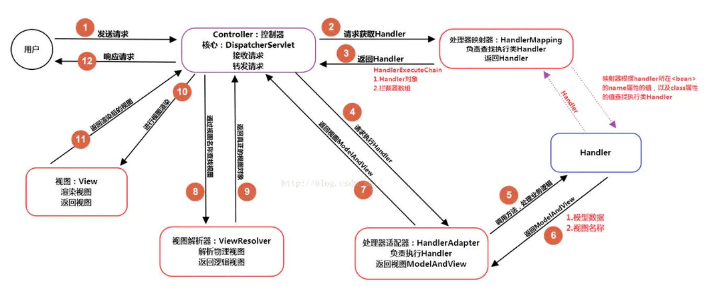

# 概述

>   SpringMVC的概念

SpringMVC是一个实现了MVC设计模式的请求驱动类型的轻量级Web框架，通过把模型-视图-控制器分离，将web层进行职责解耦，把复杂的web应用分成逻辑清晰的几部分，简化开发，减少出错，方便组内开发人员之间的配合

>   SpringMVC的优点

-   可以支持各种视图技术，而不仅仅局限于JSP
-   基于组件技术的，与Spring框架集成(如IOC容器、AOP等)
-   清晰的角色分配：前端控制器(dispatcherServlet)，请求到处理器映射(handlerMapping)， 处理器适配器(HandlerAdapter)，视图解析器(ViewResolver)
-   支持各种请求资源的映射策略
-   易于拓展
-   不依赖于 Servlet API(目标虽是如此，但是在实现的时候确实是依赖于Servlet的)

>   SpringMVC执行流程

系统启动的时候根据配置文件创建 spring 的容器，首先是发送 http 请求到核心控制器disPatherServlet，spring 容器通过映射器去寻找业务控制器，使用适配器找到相应的业务类，在进业务类时进行数据封装，在封装前可能会涉及到类型转换，执行完业务类后使用 ModelAndView进行视图转发，数据放在model 中，用map 传递数据进行页面显示

>   MVC

mvc是一种设计模式 model - view - controller，用于实现前端页面的展现与后端业务数据处理的分离

好处 :

1.   分层设计，实现了业务系统各个组件之间的解耦，有利于业务系统的可扩展性，可维护性
2.   有利于系统的并行开发，提升开发效率

>   SpringMVC和Struts2的区别

相同点：

 都是基于mvc的表现层框架，用于web项目的开发

不同点 ：

1.   前端控制器不一样。

     SpringMVC的前端控制器是servlet: DispatcherServlet

     Struts2的前端控制器是filter: StrutsPreparedAndExCutorFilter

2.   请求参数的接收方式不一样

     SpringMVC是使用方法的形参接收请求的参数，基于方法的开发， 线程安全，可以设计为单例或者多例的开发，推荐使用单例模式的开发(执行效率更高)，默认单例开发模式。

     Struts2是通过类的成员变量接收请求的参数，是基于类的开发，线程不安全， 只能设计为多例的开发

3.   Struts采用值栈存储请求和响应的数据，通过OGNL存取数据

     SpringMVC通过参数解析器是将 request请求内容解析，并给方法形参赋值，将数据和视图封装成ModelAndView对象，最后又将ModelAndView中的模型数据通过request域传输到页面。Jsp视图解析器默认使用jstl

4.   与spring整合不一样。SpringMVC是spring框架的一部分，不需要整合，SpringMVC使用更多一些

>   如何解决POST和GET请求中文乱码问题

1.   post

在web.xml中配置CharacterEncodingFilter过滤器，设置成utf-8

2.   Get方法有两个

-   修改tomcat配置文件添加编码与工程编码一致
-   对参数重写编码 ISO8859是tomcat默认编码

~~~java
String userName = new String(request.getParamter("userName").getBytes("ISO8859-1"),"utf- 8")
~~~

>   SpringMVC异常处理

将异常抛给Spring框架，由Spring框架来处理；只需要配置简单的异常处理器，在异常处理器中添视图页面即可

>   怎么在拦截请求中拦截get方式提交的方法

可以在@RequestMapping注解里面加上method=RequestMethod.GET

>   怎样在方法里面得到Request，或者Session

直接在方法的形参中声明request，SpringMVC就自动把request对象传入

>   如果想在拦截的方法里面得到从前台传入的参数，怎么得到

直接在形参里面声明这个参数就可以，但必须名字和传过来的参数一样

>   如果前台有很多个参数传入，并且这些参数都是一个对象的，如何快速得到这个对象

直接在方法中声明这个对象，SpringMVC就自动会把属性赋值到这个对象里面

>   SpringMVC中函数的返回值

ModelAndView把视图和数据都合并在一起，但一般用String比较好

>   SpringMVC用什么对象从后台向前台传递数据

通过ModelMap对象，可以在这个对象里面调用put方法，把对象加到里面，前台就可以通过el表达式拿到

>   怎么样把ModelMap里面的数据放入Session里面

在类上面加上@SessionAttributes注解，里面包含的字符串就是要放入session里面的key

>   SpringMVC中拦截器的写法

一种是实现Handlerlnterceptor接口，另外一种是继承适配器类，接着在接口方法当中，实现处理逻辑；然后在SpringMVC的配置文件中配置拦截器即可

>   WebApplicationContext

WebApplicationContext继承了ApplicationContext 并增加了一些WEB应用必备的特有功能，它不同于一般的ApplicationContext，因为它能处理主题，并找到被关联的servlet

# 核心组件

-   前端控制器DispatcherServlet(不需要程序员开发)。作用：接收请求、响应结果，相当于转发器，可以减少其它组件之间的耦合度。控制器是单例模式，在多线程访问的时候有线程安全问题，不要用同步，会影响性能的，解决方案是在控制器里面不能写字段。
-   处理器映射器HandlerMapping(不需要程序员开发)。作用：根据请求的URL来查找Handler 
-   处理器适配器HandlerAdapter。 注意：在编写Handler的时候要按照HandlerAdapter要求的规则去编写，这样适配器 HandlerAdapter才可以正确的去执行Handler
-   处理器Handler(需要程序员开发)
-   视图解析器 ViewResolver(不需要程序员开发)。作用：进行视图的解析，根据视图逻辑名解析成真正的视图
-   视图View(需要程序员开发jsp)。 View是一个接口，它的实现类支持不同的视图类型(jsp，freemarker，pd等)

# 工作原理

>   SpringMVC如何设定重定向和转发

-   转发：在返回值前面加"forward:"，譬如"forward:user.do?name=method4"
-   重定向：在返回值前面加"redirect:"，譬如"redirect:www.baidu.com"

>   SpringMVC和AJAX如何相互调用

通过Jackson框架就可以把Java里面的对象直接转化成Js可以识别的Json对象

1.   加入Jackson.jar
2.   在配置文件中配置json的映射
3.   在接受Ajax方法里面可以直接返回Object,List等，但方法前面要加上@ResponseBody注解

# 常用注解

>   原理

注解本质是一个继承了Annotation的特殊接口，其具体实现类是Java运行时生成的动态代理类。 我们通过反射获取注解时，返回的是Java运行时生成的动态代理对象。通过代理对象调用自定义注解的方法，会最终调用AnnotationlnvocationHandler的invoke方法。该方法会从memberValues这个Map中索引出对应的值。而memberValues的来源是Java常量池

>   @Controller

控制器的注解，表示为表现层。@Controller + @ResponseBody = @RestController

@Controller标记在类上，实际进行请求处理的是@RequestMapping(标记在方法上)

将控制器类交给Spring管理的方式：

-   在SpringMVC的配置文件中定义MyController的bean对象
-   在SpringMVC的配置文件中告诉Spring该到哪里去找标记为@Controller的Controller控制器

>   @RequestMapping

处理请求中url的映射，六个数学如下：

-   value：请求的实际地址
-   method：方法类型，post、get等
-   consumes：指定请求的提交内容(Context-Type)，例如application/json
-   produces：指定返回的内容类型，仅当request请求头中的(Accept)类型中包含该指定类型才返回
-   params：指定request中必须包含某些参数值，才让该方法处理
-   headers：指定request中必须包含某些指定的header值，才让该方法处理

>   @ResponseBody

将controller返回对象转化成json返回给客户

>   @RequestBody

接收http请求中的json数据，转化成Java对象

>   @PathVariable 和 @RequestParam的区别

前者获取 URL 路径中的变量，后者获取 URL中 ? 后面的查询参数

