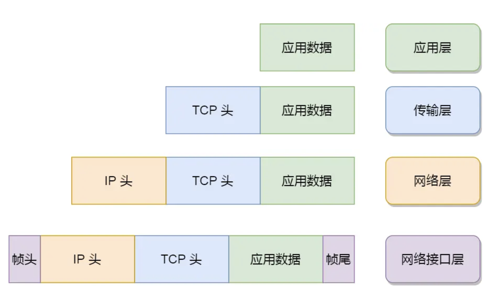
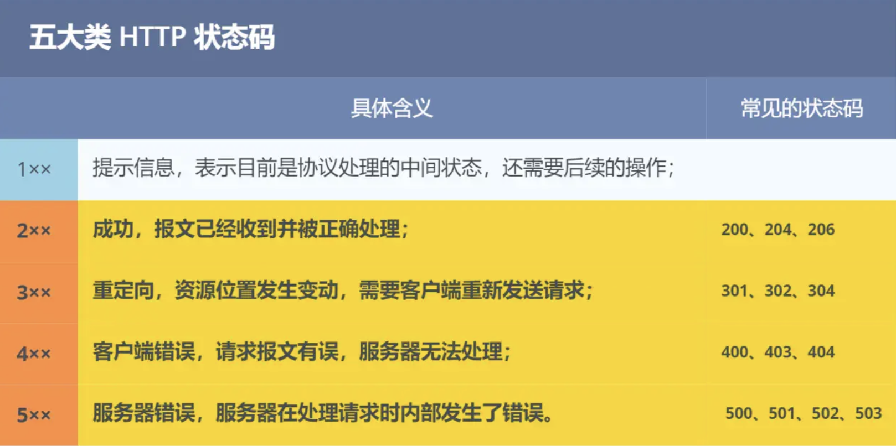
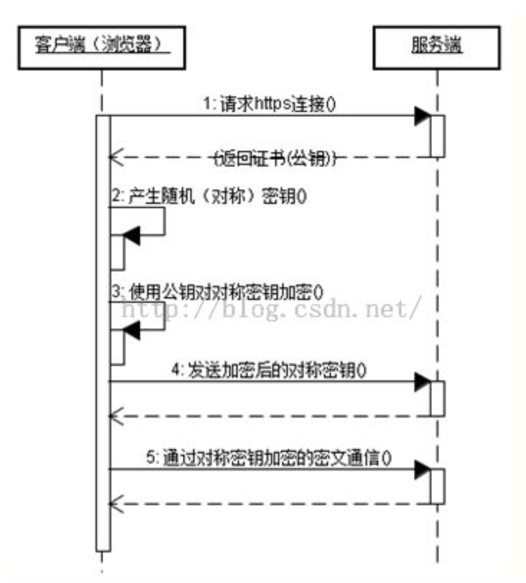

# 网络基础篇

## TCP/IP网络模型

### 应用层

应⽤层只需要专注于为⽤户提供应⽤功能，⽐如 HTTP、FTP、Telnet、DNS、SMTP等。

### 传输层

TCP UDP

## 网络层

IP

### 网络接口层

MAC

⽹络接⼝层的传输单位是帧（frame），IP 层的传输单位是包（packet），TCP 层的传输单位是段
（segment），HTTP 的传输单位则是消息或报⽂（message）。但这些名词并没有什么本质的区分，可以
统称为数据包。

## 输入网址到网页显示，期间发生了什么

1.   浏览器接收到用户请求，先检查浏览器缓存里是否有缓存该资源，如果有直接返回；如果没有进入下一 步网络请求
2.   网络请求前，进行 DNS解析，以获取请求域名的 IP地址。如果请求协议是 HTTPS，那么还需要建立TLS连接。DNS解析时会按本地浏览器缓存->本地 Host 文件->路由器缓存-> DNS 服务器-> 根 DNS 服务器的顺序查询域名对应 IP，直到找到为止
3.   浏览器与服务器IP建立TCP连接。连接建立后，浏览器端会构建请求行、请求头等信息，并把和该域名相关的 Cookie 等数据附加到请求头中，向服务器构建请求信息
4.   服务器接收到请求信息，根据请求生成响应数据
5.   浏览器解析响应头。若响应头状态码为 301、302，会重定向到新地址；若响应数据类型是字节流类型，一般会将请求提交给下载管理器；若是HTML类型，会进入下一步渲染流程
6.   浏览器解析 HTML 文件，创建 DOM 树，解析 CSS 进行样式计算，然后将CSS和DOM合并，构建渲染树；最后布局和绘制渲染树，完成页面展示

解析URL  -->  真实地址查询(DNS)
网卡 																					

交换机

路由器

## Linux如何收发网络包

# HTTP篇

## HTTP基本概念

>   HTTP是什么

超⽂本传输协议，是⼀个在计算机世界⾥专⻔在「两点」之间「传输」⽂字、图⽚、⾳频、视频等「超⽂本」数据的「约定和规范」。

>   HTTP常见状态码

>   HTTP常见字段

Host 、 Content-Length 、 Connection 、Content-Type 、Content-Encoding 

 (客户端对应: Accept 、 Accept-Encoding)

## GET 和 POST

>   GET 和 POST 的区别

GET：获取指定资源

POST：对指定资源进行处理

>   GET 和 POST方法都是安全和幂等的吗

安全：不会破坏服务器上的资源； 幂等：多次操作，结果都是相同的

GET   安全且幂等的，可以对GET请求的数据做缓存

POST 不安全 不幂等，一般不会缓存POST请求

## HTTP特性

>   HTTP(1.1) 的优点

>   HTTP(1.1) 的缺点

>   HTTP/1.1 的性能

## HTTP缓存技术

>   强制缓存的概念

只要浏览器判断缓存没有过期，则直接使⽤浏览器的本地缓存，决定是否使⽤缓存的主动性在于浏览器这边

强制缓存是利⽤两个 HTTP 响应头部（**Response** Header）实现，**Cache-Control** (相对时间，选项更多⼀些，设置更加精细，建议)的优先级⾼于 **Expires** (绝对时间)

>   协商缓存的概念

通过服务端告知客户端是否可以使⽤缓存的⽅式，可以基于两种头部来实现

1.  请求头部中的 If-Modified-Since 字段与响应头部中的 Last-Modified 字段
2.  请求头部中的 If-None-Match 字段与响应头部中的 ETag 字段

## HTTPS 和 HTTP

>   HTTPS 和 HTTP的区别

>   HTTPS 解决了 HTTP 的哪些问题

>   HTTPS 如何建立连接

## HTTP/1.1 、HTTP/2 、HTTP/3演变

>   HTTP/1.1 相比 HTTP/1.0提高了什么性能

>   HTTP/2 做了什么优化

>   HTTP/3 做了什么优化

## HTTP/1.1如何优化

## HTTP RSA握手解析

## HTTP ECDHE 握手解析

## HTTPS如何优化

## HTTP/2强势处

## HTTP/3强势处

## 既然有HTTP协议，为什么要有RPC

## 既然有HTTP协议，为什么要有WebSocket

# TCP篇
## TCP 三次挥手和四次挥手

>   TCP 三次握手过程

## TCP 实战抓包
## TCP半连接队列和全连接队列

## 如何优化TCP

## SYN报文

# IP篇

## IP基础知识

## ping的工作原理

# 总结

>   简述OSI七层协议

物理层，数据链路层，网络层，运输层，会话层，表示层，应用层

>   简述TCP/IP五层协议

物理层，数据链路层，网络层，运输层，应用层

>   物理层有什么作用

主要解决两台物理机之间的通信，通过二进制比特流的传输来实现，二进制数据表现为电流电压上的强弱，到达目的地再转化为二进制机器码。网卡、集线器工作在这一层

>   数据链路层有什么作用

在不可靠的物理介质上提供可靠的传输，接收来自物理层的位流形式的数据，并封装成帧，传送到上一 层；同样，也将来自上层的数据帧，拆装为位流形式的数据转发到物理层。这一层在物理层提供的比特流的基础上，通过差错控制、流量控制方法，使有差错的物理线路变为无差错的数据链路。提供物理地址寻址功能。交换机工作在这一层

>   网络层有什么作用

将网络地址翻译成对应的物理地址，并决定如何将数据从发送方路由到接收方，通过路由选择算法为分组通过通信子网选择最佳路径。路由器工作在这一层

>   传输层有什么作用

传输层提供了进程间的逻辑通信，传输层向高层用户屏蔽了下面网络层的核心细节，使应用程序看起来像是在两个传输层实体之间有一条端到端的逻辑通信信道

>   会话层

建立会话：身份验证，权限鉴定等； 保持会话：对该会话进行维护，在会话维持期间两者可以随时使用这条会话传输局； 断开会话：当应用程序或应用层规定的超时时间到期后，OSI会话层才会释放这条会话

>   表示层

对数据格式进行编译，对收到或发出的数据根据应用层的特征进行处理，如处理为文字、图片、音频、 视频、文档等，还可以对压缩文件进行解压缩、对加密文件进行解密等

>   应用层

应用程序的通信服务，例如HTTP、FTP、telnet、SMTP等

>   TCP与UDP区别

TCP作为面向流的协议，提供可靠的、面向连接的运输服务，并且提供点对点通信

UDP作为面向报文的协议，不提供可靠交付，并且不需要连接，不仅仅对点对点，也支持多播和广播

>   为何TCP可靠

TCP有三次握手建立连接，四次挥手关闭连接的机制。 除此之外还有滑动窗口和拥塞控制算法。最最关键的是还保留超时重传的机制。 对于每份报文也存在校验，保证每份报文可靠性

>   为何UDP不可靠

UDP面向数据报无连接的，数据报发出去，就不保留数据备份了

仅仅在IP数据报头部加入校验和复用

UDP没有服务器和客户端的概念

UDP报文过长的话是交给IP切成小段，如果某段报废报文就废了

>   简述TCP粘包现象

TCP是面向流协议，发送的单位是字节流，因此会将多个小尺寸数据被封装在一个tcp报文中发出去的可能性。 可以简单的理解成客户端调用了两次send，服务器端一个recv就把信息都读出来了

>   TCP粘包现象处理方法

固定发送信息长度，或在两个信息之间加入分隔符

>   简述TCP协议的滑动窗口

滑动窗口是传输层进行流量控制的一种措施，接收方通过通告发送方自己的窗口大小，从而控制发送方的发送速度，防止发送方发送速度过快而导致自己被淹没

>   简述TCP协议的拥塞控制

拥塞是指一个或者多个交换点的数据报超载，TCP又会有重传机制，导致过载。 为了防止拥塞窗口cwnd增长过大引起网络拥塞，还需要设置一个慢开始门限ssthresh状态变量

当cwnd＜ssthresh 时，使用慢开始算法

当cwnd > ssthresh 时，停止使用慢开始算法而改用拥塞避免算法

当cwnd = ssthresh 时，即可使用慢开始算法，也可使用拥塞避免算法

慢开始：由小到大逐渐增加拥塞窗口的大小，每接一次报文，cwnd指数增加

拥塞避免：cwnd缓慢地增大，即每经过一个往返时间RTT就把发送方的拥塞窗口cwnd加1

快恢复之前的策略：发送方判断网络出现拥塞，就把ssthresh设置为出现拥塞时发送方窗口值的一半，继续执行慢开始，之后进行拥塞避免

快恢复：发送方判断网络出现拥塞，就把ssthresh设置为出现拥塞时发送方窗口值的一半，并把cwnd设置为ssthresh的一半，之后进行拥塞避免

>   简述快重传

如果在超时重传定时器溢出之前，接收到连续的三个重复冗余ACK，发送端便知晓哪个报文段在传输过程中丢失了，于是重发该报文段，不需要等待超时重传定时器溢出再发送该报文

>   TCP三次握手过程

1. 客户端将标志位SYN置为1，随机产生一个值序列号seq=X，并将该数据包发送给服务端，客户端进入syn_send状态，等待服务端确认
1. 服务端收到数据包后由标志位SYN=1知道客户端请求建立连接，服务端将标志位SYN和ACK都置为1，ack=x+1，随机产生一个值seq=y，并将该数据包发送给客户端以确认连接请求，服务端进入syn_rcvd状态
1. 客户端收到确认后检查，如果正确则将标志位ACK为1，ack=y+1，并将该数据包发送给服务端，服务端进行检查如果正确则连接建立成功，客户端和服务端进入established状态，完成三次握手

>   为什么TCP握手需要三次

TCP进行可靠传输的关键就在于维护一个序列号，三次握手的过程即是通信双方相互告知序列号起始值，并确认对方已经收到了序列号起始值。 如果只是两次握手，至多只有客户端的起始序列号能被确认，服务器端的序列号则得不到确认

>   简述半连接队列

TCP握手中，当服务器处于SYN_RCVD状态，服务器会把此种状态下请求连接放在一个队列里，该队列称为半连接队列

>   简述SYN攻击

SYN攻击即利用TCP协议缺陷，通过发送大量的半连接请求，占用半连接队列，耗费CPU和内存资源

优化方式： 

1.   缩短SYN Timeou间 

2. 记录IP，若连续受到某个IP的重复SYN报文，从这个IP地址来的包会被一概丢弃

>   TCP四次挥手过程

1.   第一次挥手：客户端发送一个FIN，用来关闭客户端到服务端的数据传送，客户端进入fin_wait_1状态

2.   第二次挥手：服务端收到FIN后，发送一个ACK给客户端，确认序号为收到序号+1，服务端进入Close_wait状态。此时TCP连接处于半关闭状态，即客户端已经没有要发送的数据了，但服务端若发送数据，则客户端仍要接收

3.   第三次挥手：服务端发送一个FIN，用来关闭服务端到客户端的数据传送，服务端进入Last_ack状态
4.   第四次挥手：客户端收到FIN后，客户端进入Time_wait状态，接着发送一个ACK给服务端，确认后，服务端进入Closed状态，完成四次挥手

>   为什么TCP挥手需要4次

主要原因是当服务端收到客户端的 FIN数据包后，服务端可能还有数据没发完，不会立即close

所以服务端会先将ACK发过去告诉客户端我收到你的断开请求了，但请再给我一点时间，这段时间用来发送剩下的数据报文，发完之后再将 FIN 包发给客户端表示现在可以断了。之后客户端需要收到 FIN 包后发送 ACK 确认断开信息给服务端

>   为什么四次挥手释放连接时需要等待2MSL

MSL即报文最大生存时间。设置2MSL可以保证上一次连接的报文已经在网络中消失，不会出现与新TCP连接报文冲突的情况

>   简述DNS协议

DNS协议是基于UDP的应用层协议，它的功能是根据用户输入的域名，解析出该域名对应的IP地址，从 而给客户端进行访问

>   简述DNS解析过程

1.   客户机发出查询请求，在本地计算机缓存查找，若没有找到，就会将请求发送给dns服务器
2.   本地dns服务器会在自己的区域里面查找，找到即根据此记录进行解析，若没有找到，就会在本地的缓存里面查找
3.   本地服务器没有找到客户机查询的信息，就会将此请求发送到根域名dns服务器
4.   根域名服务器解析客户机请求的根域部分，它把包含的下一级的dns服务器的地址返回到客户机的 dns服务器地址
5.   客户机的dns服务器根据返回的信息接着访问下一级的dns服务器
6.   这样递归的方法一级一级接近查询的目标，最后在有目标域名的服务器上面得到相应的IP信息 
7.   客户机的本地的dns服务器会将查询结果返回给我们的客户机 8、客户机根据得到的ip信息访问目标主机，完成解析过程

>   简述HTTP协议

http协议是超文本传输协议。它是基于TCP/IP协议的应用层传输协议，即客户端和服务端进行数据传输的一种规则。该协议本身HTTP 是一种无状态的协议

>   简述cookie

HTTP 协议本身是无状态的，为了使其能处理更加复杂的逻辑，HTTP/1.1引入 Cookie 来保存状态信息。 Cookie是由服务端产生的，再发送给客户端保存，当客户端再次访问的时候，服务器可根据cookie辨识客户端是哪个，以此可以做个性化推送，免账号密码登录等等

>   简述session

用于标记特定客户端信息，存在在服务器的一个文件里。 一般客户端带Cookie对服务器进行访问，可通过cookie中的session id从整个session中查询到服务器记录的关于客户端的信息

>   简述http状态码和对应的信息

1XX：接收的信息正在处理

2XX：请求正常处理完毕

3XX：重定向

4XX：客户端错误

5XX：服务端错误

常见错误码：

301：永久重定向

302：临时重定向

304：资源没修改，用之前缓存就行

400：客户端请求的报文有错误

403：表示服务器禁止访问资源

404：表示请求的资源在服务器上不存在或未找到

>   转发和重定向的区别

转发是服务器行为。服务器直接向目标地址访问URL，将相应内容读取之后发给浏览器，用户浏览器地址栏URL不变，转发页面和转发到的页面可以共享request里面的数据

重定向是利用服务器返回的状态码来实现的，如果服务器返回301或者302，浏览器收到新的消息后自动跳转到新的网址重新请求资源。用户的地址栏url会发生改变，而且不能共享数据

>   302跳转的逻辑

1.   DNS域名解析

2.   建立TCP连接
3.   发送HTTP请求
4.   服务器处理请求
5.   返回响应结果
6.   关闭TCP连接
7.   浏览器解析HTML
8.   浏览器布局渲染

>   简述http1.0

规定了请求头和请求尾，响应头和响应尾（get post） 每一个请求都是一个单独的连接，做不到连接的复用

>   简述http1.1的改进

HTTP1.1默认开启长连接，在一个TCP连接上可以传送多个HTTP请求和响应。使用TCP 长连接的方式改善了 HTTP/1.0 短连接造成的性能开销

支持管道（pipeline）网络传输，只要第一个请求发出去了，不必等其回来，就可以发第二个请求出去，可以减少整体的响应时间

服务端无法主动push

>   简述HTTP短连接与长连接区别

HTTP中的长连接短连接指HTTP底层TCP的连接

短连接：客户端与服务器进行一次HTTP连接操作，就进行一次TCP连接，连接结束TCP关闭连接

长连接：如果HTTP头部带有参数keep-alive，即开启长连接网页完成打开后，底层用于传输数据的TCP连接不会直接关闭，会根据服务器设置的保持时间保持连接，保持时间过后连接关闭

简述http2.0的改进

提出多路复用。多路复用前，文件时串行传输的，请求a文件，b文件只能等待，并且连接数过多。引入多路复用，a文件b文件可以同时传输

引入了二进制数据帧。其中帧对数据进行顺序标识，有了序列id，服务器就可以进行并行传输数据

>   http与https的区别

http所有传输的内容都是明文，并且客户端和服务器端都无法验证对方的身份，http连接是简单、灵活、快捷、无状态、无连接的

https具有安全性的ssl加密传输协议，加密采用对称加密，可以将HTTPS协议简单理解为HTTP协议+ TLS/SSL

https协议需要到ca申请证书，一般免费证书很少，需要交费

端口HTTP:80，HTTPS:443

>   简述TLS/SSL

SSL全称为Secure Sockets Layer即安全套接层，其继任为TLSTransport Layer Security传输层安全协议，均用于在传输层为数据通讯提供安全支持

>   https的连接过程

1. 浏览器将支持的加密算法信息发给服务器
1. 服务器选择一套浏览器支持的加密算法，以证书的形式(包含网站信息、加密公钥、证书的颁发机构)回发给浏览器
1. 客户端（SSL/TLS）解析证书验证证书合法性，生成对称加密的密钥，我们将该密钥称之为client key，即客户端密钥，用服务器的公钥对客户端密钥进行非对称加密
1. 客户端会发起HTTPS中的第二个HTTP请求，将加密之后的客户端对称密钥发送给服务器
1. 服务器接收到客户端发来的密文之后，会用自己的私钥对其进行非对称解密，解密之后的明文就是客户端密钥，然后用客户端密钥对数据进行对称加密，这样数据就变成了密文
1. 服务器将加密后的密文发送给客户端
1. 客户端收到服务器发送来的密文，用客户端密钥对其进行对称解密，得到服务器发送的数据。这样 HTTPS中的第二个HTTP请求结束，整个HTTPS传输完成

注意的是：证书是一个公钥，这个公钥是进行加密用的。而私钥是进行解密用的。公钥任何都知道，私钥只有自己知道。这是非对称加密

而对称加密就是钥匙只有一把，我们都知道

之所以用到对称加密，是因为对称加密的速度更快。而非对称加密的可靠性更高。

>   Rest API

Rest是一种软件架构风格；REST API全称为表述性状态转移（Representational State Transfer, REST）即利用HTTP中get、 post. put、delete以及其他的HTTP方法构成REST中数据资源的增删改查操作

>   浏览器中输入一个网址后，具体发生了什么

1. 进行DNS解析操作，根据DNS解析的结果查到服务器IP地址
1. 通过ip寻址和arp，找到服务器，并利用三次握手建立TCP连接
1. 浏览器生成HTTP报文，发送HTTP请求，等待服务器响应
1. 服务器处理请求，并返回给浏览器
1. 根据HTTP是否开启长连接，进行TCP的挥手过程
1. 浏览器根据收到的静态资源进行页面渲染

>   交换机和路由器的区别

1.   工作层次不同
2.   数据转发所依据的对象不同：交换机利用MAC地址，路由器利用IP地址
3.   传统的交换机可以分割冲突域，不能分割广播域，而路由器可以分割广播域；虽然三层交换机可以分割广播域，但是子广播域之间不能通信，还是需要路由器
4.   路由器提供防火墙服务
5.   二层交换机上存在MAC表，三层交换机上存在路由表、MAC表、ARP 表，路由器上存在路由表和ARP表

总之，交换机在具体的城域网中扮演着VLAN透传的角色，就是桥。路由器的每一个端口都是一个独立的广播域和冲突域，而交换机是只有一个广播域 和端口数量的冲突域

>   Socket网络通信

NIO流以及多线程处理技术： BIO：阻塞式，线程池初始时创建一定量线程，超过则等待； NIO：非阻塞式，不同的线程干专业的事情，提高系统吞吐量； NIO+异步处理：让少量的线程做大量的事情；

>   Mina

Apache Mina是一个能够帮助用户开发高性能和高伸缩性网络应用程序的框架。它通过Java nio技术基于TCP/IP和UDP/IP协议提供了抽象的、事件驱动的、异步的APl。采用非阻塞方式的异步传输， 支持批量传输数据。mina框架简单高效，完成了底层的线程管理，内置编码器能够满足大多数用户的需求，省去了消息编码和解码的工作

>   Netty

本质是JBoss开发的一个jar包，目的是开发高性能、高可靠性的网络服务和客户端服务；提供异步非阻塞的、事件驱动的网络应用程序的NIO框架和工具；处理socket；通过Future-Listener机制，用 户可以方便的主动获取或者通过通知机制获得IO操作结果

>   rpc和http的区别

-   传输协议 。RPC，可以基于TCP协议，也可以基于HTTP协议
-   传输效率 。RPC，使用自定义的TCP协议，可以让请求报文体积更小， 或者使用HTTP2协议，也可以很好的减少报文的体积，提高传输效率 。HTTP，如果是基于HTTP1.1的协议，请求中会包含很多无用的内容，如果是基于HTTP2.0，那么简单的封装以下是可以作为一个RPC来使用的，这时标准RPC框架更多的是服务治理
-   性能消耗，主要在于序列化和反序列化的耗时 。RPC，可以基于thrift实现高效的二进制传输；HTTP，大部分是通过json来实现的，字节大小和序列化耗时都比thrift要更消耗性能
-   负载均衡 。RPC基本都自带了负载均衡策略；HTTP需要配置Nginx，HAProxy来实现
-   服务治理（下游服务新增，重启，下线时如何不影响上游调用者) RPC，能做到自动通知，不影上游；HTTP，需要事先通知，修改Nginx/HAProxy配置

总结：RPC主要用于公司内部的服务调用，性能消耗低，传输效率高，服务治理方便。HTTP主要用于对外的异构环境，浏览器接口调用，APP接口调用，第三方接口调用等。
